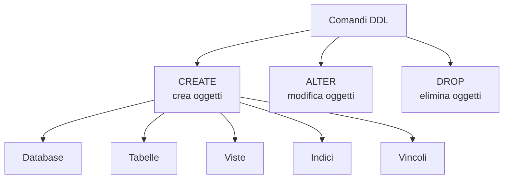
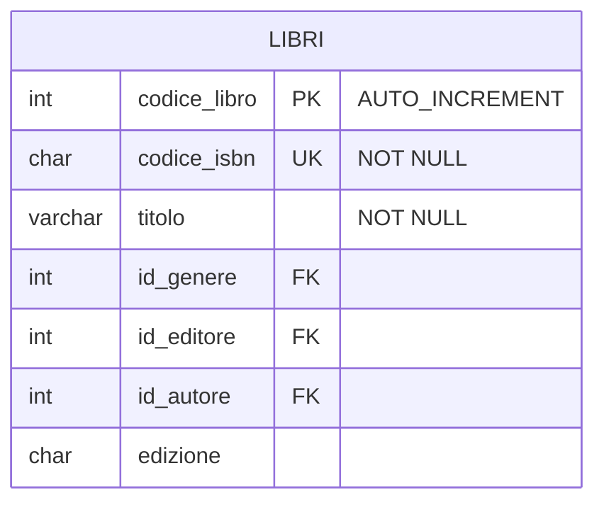
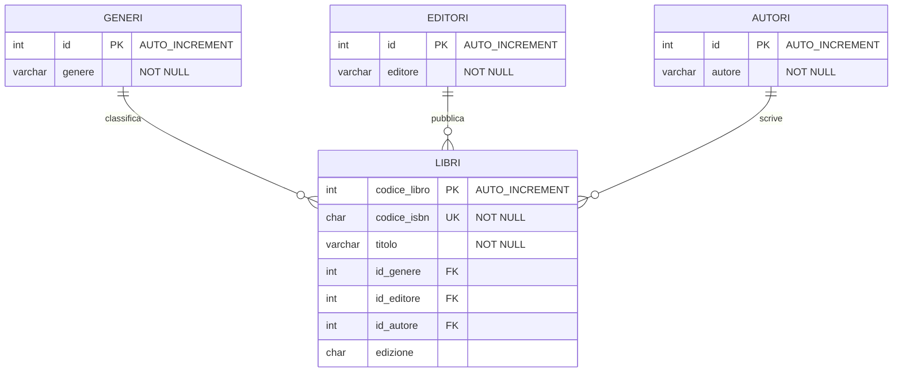
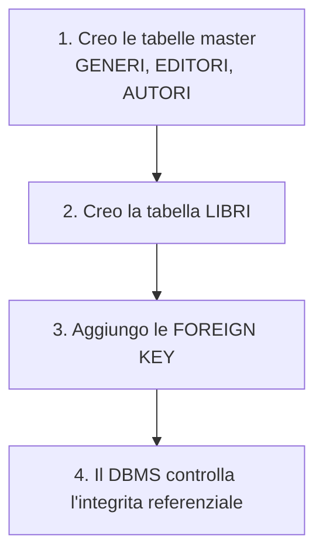
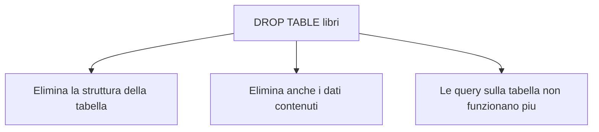
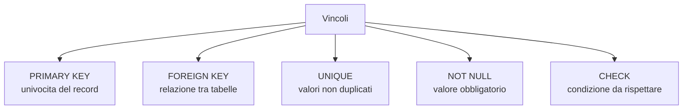
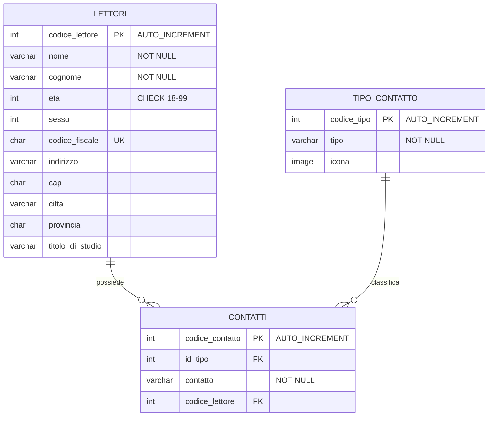

# 08 - Comandi DDL

## Obiettivi della lezione

Al termine di questa unità il partecipante deve essere in grado di:

- spiegare a cosa servono i comandi DDL;
- creare una tabella con `CREATE TABLE`;
- leggere uno schema fisico e tradurlo in SQL;
- usare `ALTER TABLE` per modificare una tabella;
- riconoscere e applicare vincoli come `PRIMARY KEY`, `FOREIGN KEY`, `UNIQUE`, `NOT NULL`, `CHECK`;
- capire perché l'ordine di creazione delle tabelle è importante quando esistono chiavi esterne.

---

## 1. Data Definition Language

I comandi **DDL**, cioè **Data Definition Language**, permettono di creare, modificare o eliminare gli oggetti che costituiscono la struttura di un database.

Oggetti tipici:

- database;
- tabelle;
- viste;
- indici;
- vincoli;
- utenti.

I comandi principali sono:

| Comando | Significato |
|---|---|
| `CREATE` | crea un nuovo oggetto |
| `ALTER` | modifica un oggetto esistente |
| `DROP` | elimina un oggetto esistente |



---

## 2. Creazione di una tabella

Per creare una tabella si usa il comando:

```sql
CREATE TABLE nome_tabella (
    nome_colonna tipo_dato vincoli,
    nome_colonna tipo_dato vincoli
);
```

La struttura minima richiede:

- il nome della tabella;
- l'elenco delle colonne;
- il tipo di dato di ogni colonna;
- eventuali vincoli.

---

## 3. Esempio: tabella `LIBRI`

Schema fisico di partenza:



Traduzione SQL:

```sql
CREATE TABLE libri (
    codice_libro INT AUTO_INCREMENT PRIMARY KEY,
    codice_isbn CHAR(10) NOT NULL UNIQUE,
    titolo VARCHAR(50) NOT NULL,
    id_genere INT,
    id_editore INT,
    id_autore INT,
    edizione CHAR(4)
);
```

Spiegazione dei vincoli usati:

| Elemento | Significato |
|---|---|
| `AUTO_INCREMENT` | genera automaticamente un valore numerico progressivo |
| `PRIMARY KEY` | identifica univocamente ogni record |
| `UNIQUE` | impedisce duplicati nella colonna |
| `NOT NULL` | rende obbligatorio il valore della colonna |

---

## 4. Tabelle tipizzate collegate a `LIBRI`

La tabella `LIBRI` contiene tre chiavi esterne:

- `id_genere` verso `GENERI`;
- `id_editore` verso `EDITORI`;
- `id_autore` verso `AUTORI`.



Creazione delle tabelle tipizzate:

```sql
CREATE TABLE generi (
    id INT AUTO_INCREMENT PRIMARY KEY,
    genere VARCHAR(50) NOT NULL
);

CREATE TABLE editori (
    id INT AUTO_INCREMENT PRIMARY KEY,
    editore VARCHAR(50) NOT NULL
);

CREATE TABLE autori (
    id INT AUTO_INCREMENT PRIMARY KEY,
    autore VARCHAR(50) NOT NULL
);
```

---

## 5. Aggiunta delle chiavi esterne

Dopo aver creato le tabelle `GENERI`, `EDITORI` e `AUTORI`, è possibile collegare `LIBRI` tramite vincoli di integrità referenziale.

```sql
ALTER TABLE libri
ADD CONSTRAINT fk_libri_generi
FOREIGN KEY (id_genere)
REFERENCES generi(id);

ALTER TABLE libri
ADD CONSTRAINT fk_libri_editori
FOREIGN KEY (id_editore)
REFERENCES editori(id);

ALTER TABLE libri
ADD CONSTRAINT fk_libri_autori
FOREIGN KEY (id_autore)
REFERENCES autori(id);
```



L'ordine è importante: una chiave esterna può riferirsi solo a una tabella già esistente. Il DBMS, pur avendo molte qualità, non può collegarsi a una tabella che non esiste ancora. Piccolo dettaglio, spesso dimenticato con grande creatività.

---

## 6. Modifica di una tabella

Per modificare una tabella esistente si usa:

```sql
ALTER TABLE nome_tabella operazione;
```

Con `ALTER TABLE` si possono eseguire diverse operazioni:

- aggiungere colonne;
- eliminare colonne;
- modificare il tipo di dato di una colonna;
- aggiungere vincoli;
- eliminare vincoli;
- modificare alcune caratteristiche strutturali della tabella.

---

## 7. Esempi di `ALTER TABLE`

### Aggiungere una colonna

```sql
ALTER TABLE nome_tabella
ADD nome_colonna tipo_dato;
```

Esempio:

```sql
ALTER TABLE lettori
ADD email VARCHAR(100);
```

### Aggiungere una colonna in una posizione specifica

In MySQL/MariaDB si può indicare la posizione della nuova colonna:

```sql
ALTER TABLE nome_tabella
ADD nuova_colonna tipo_dato FIRST;

ALTER TABLE nome_tabella
ADD nuova_colonna tipo_dato AFTER colonna_esistente;
```

### Modificare il tipo di una colonna

```sql
ALTER TABLE nome_tabella
MODIFY nome_colonna nuovo_tipo;
```

Esempio:

```sql
ALTER TABLE lettori
MODIFY email VARCHAR(150);
```

### Rinominare una colonna

In MySQL recente si può usare:

```sql
ALTER TABLE nome_tabella
RENAME COLUMN vecchio_nome TO nuovo_nome;
```

In altri DBMS la sintassi può cambiare. Quando si lavora su un DBMS specifico è quindi necessario verificare la documentazione ufficiale.

### Eliminare una colonna

```sql
ALTER TABLE nome_tabella
DROP COLUMN nome_colonna;
```

---

## 8. Eliminazione di una tabella

Per eliminare una tabella si usa:

```sql
DROP TABLE nome_tabella;
```

Esempio:

```sql
DROP TABLE libri;
```

Attenzione: `DROP TABLE` elimina la tabella e la sua struttura. Non è una cancellazione di singoli record. Per i record si usa `DELETE`, che appartiene ai comandi DML.



---

## 9. Vincoli

Un **vincolo** è una regola applicata a una tabella o a una colonna per controllare la validità dei dati.

Vincoli principali:

| Vincolo | Significato |
|---|---|
| `PRIMARY KEY` | identifica univocamente ogni record |
| `FOREIGN KEY` | collega una colonna alla chiave primaria di un'altra tabella |
| `UNIQUE` | impedisce valori duplicati |
| `NOT NULL` | rende obbligatorio il valore |
| `CHECK` | impone una condizione sui valori ammessi |



---

## 10. Schema fisico: `LETTORI`, `CONTATTI`, `TIPO_CONTATTO`



---

## 11. Creazione della tabella `LETTORI`

La tabella `LETTORI` non dipende da altre tabelle tramite chiavi esterne, quindi può essere creata per prima.

```sql
CREATE TABLE lettori (
    codice_lettore INT AUTO_INCREMENT PRIMARY KEY,
    nome VARCHAR(50) NOT NULL,
    cognome VARCHAR(50) NOT NULL,
    eta INT CHECK (eta >= 18 AND eta <= 99),
    sesso INT,
    codice_fiscale CHAR(16) UNIQUE NOT NULL,
    indirizzo VARCHAR(50),
    cap CHAR(5),
    citta VARCHAR(100),
    provincia CHAR(2),
    titolo_di_studio VARCHAR(100)
);
```

---

## 12. Creazione di `CONTATTI` con una chiave esterna

`CONTATTI` dipende da `LETTORI`, perché ogni contatto appartiene a un lettore.

```sql
CREATE TABLE contatti (
    codice_contatto INT AUTO_INCREMENT PRIMARY KEY,
    id_tipo INT,
    contatto VARCHAR(50) NOT NULL,
    codice_lettore INT,
    CONSTRAINT fk_contatti_lettori
        FOREIGN KEY (codice_lettore)
        REFERENCES lettori(codice_lettore)
);
```


---

## 13. Creazione di `TIPO_CONTATTO` e collegamento a `CONTATTI`

```sql
CREATE TABLE tipo_contatto (
    codice_tipo INT AUTO_INCREMENT PRIMARY KEY,
    tipo VARCHAR(50) NOT NULL,
    icona BLOB
);
```

Dopo la creazione di `TIPO_CONTATTO`, si può aggiungere la chiave esterna sulla colonna `id_tipo` della tabella `CONTATTI`.

```sql
ALTER TABLE contatti
ADD CONSTRAINT fk_contatti_tipo_contatto
FOREIGN KEY (id_tipo)
REFERENCES tipo_contatto(codice_tipo);
```


---

## 14. Altri esempi di vincoli con `ALTER TABLE`

### Aggiungere una chiave primaria

```sql
ALTER TABLE nome_tabella
ADD PRIMARY KEY (nome_colonna);
```

### Aggiungere una chiave primaria assegnando un nome al vincolo

```sql
ALTER TABLE nome_tabella
ADD CONSTRAINT nome_vincolo
PRIMARY KEY (nome_colonna);
```

### Aggiungere una chiave esterna

```sql
ALTER TABLE tabella_figlia
ADD CONSTRAINT nome_vincolo
FOREIGN KEY (colonna_fk)
REFERENCES tabella_master(colonna_pk);
```

### Aggiungere un vincolo `CHECK`

```sql
ALTER TABLE nome_tabella
ADD CONSTRAINT nome_vincolo
CHECK (condizione);
```

Esempio:

```sql
ALTER TABLE lettori
ADD CONSTRAINT chk_lettori_eta
CHECK (eta >= 18 AND eta <= 99);
```

---

## Sintesi finale

I comandi DDL servono a definire e modificare la struttura del database. `CREATE TABLE` crea le tabelle, `ALTER TABLE` le modifica, `DROP TABLE` le elimina. I vincoli permettono di impedire dati errati, duplicati o incoerenti. Quando sono presenti chiavi esterne, l'ordine di creazione delle tabelle e dei vincoli diventa essenziale.
