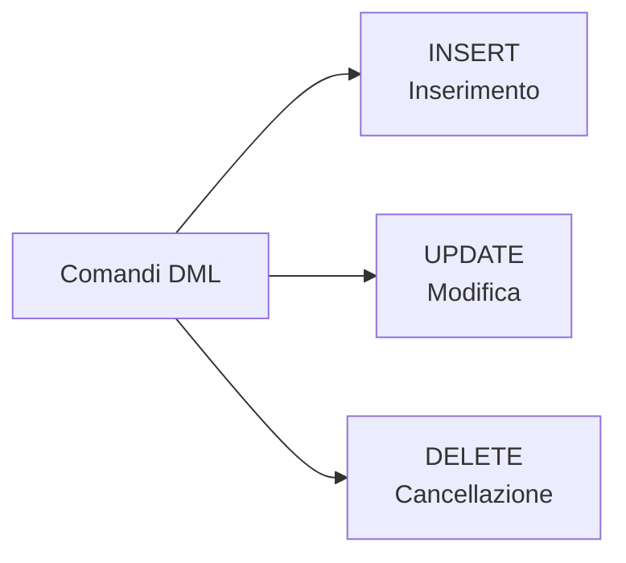
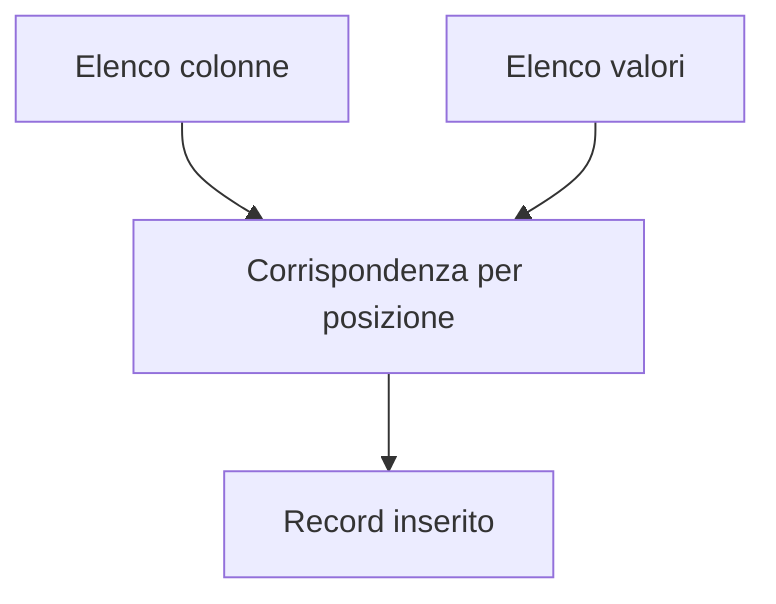
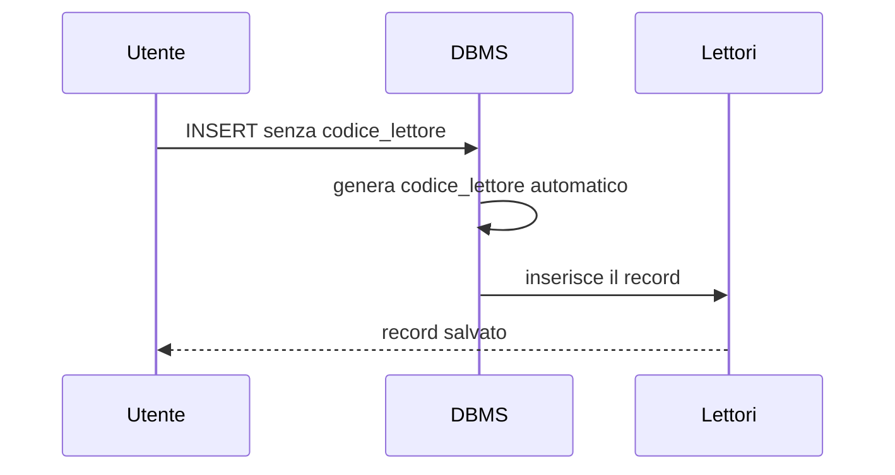
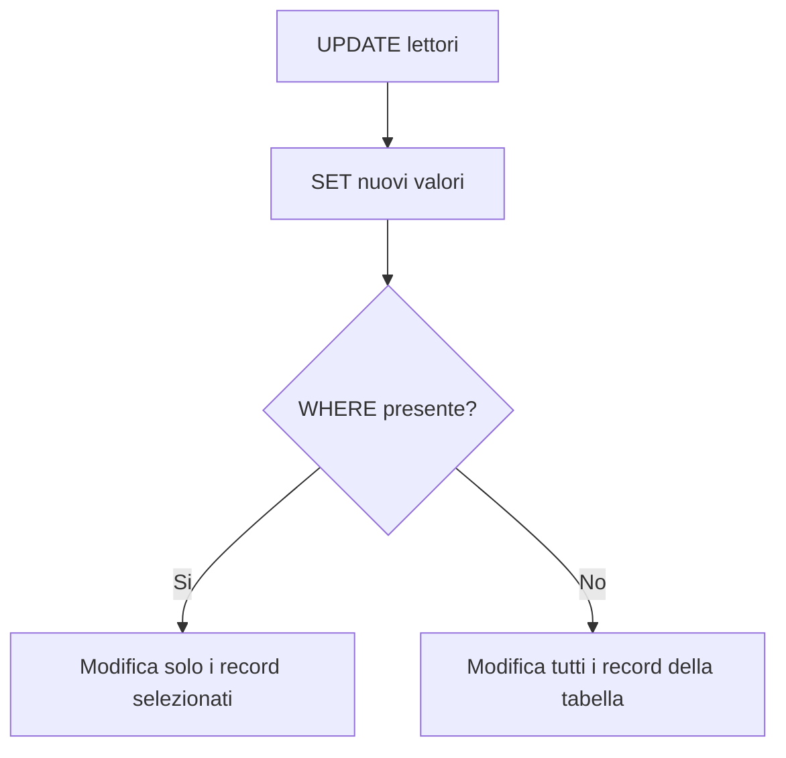
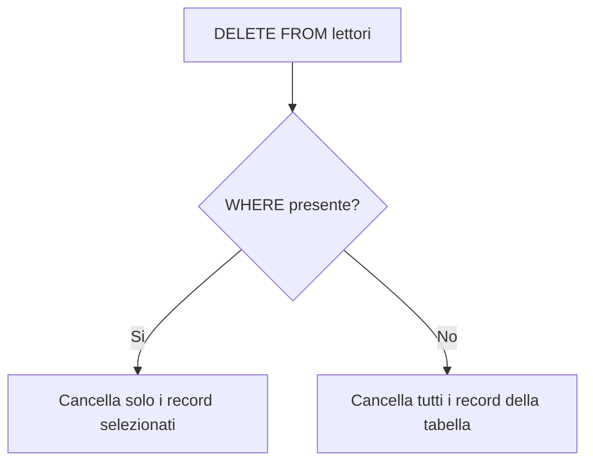
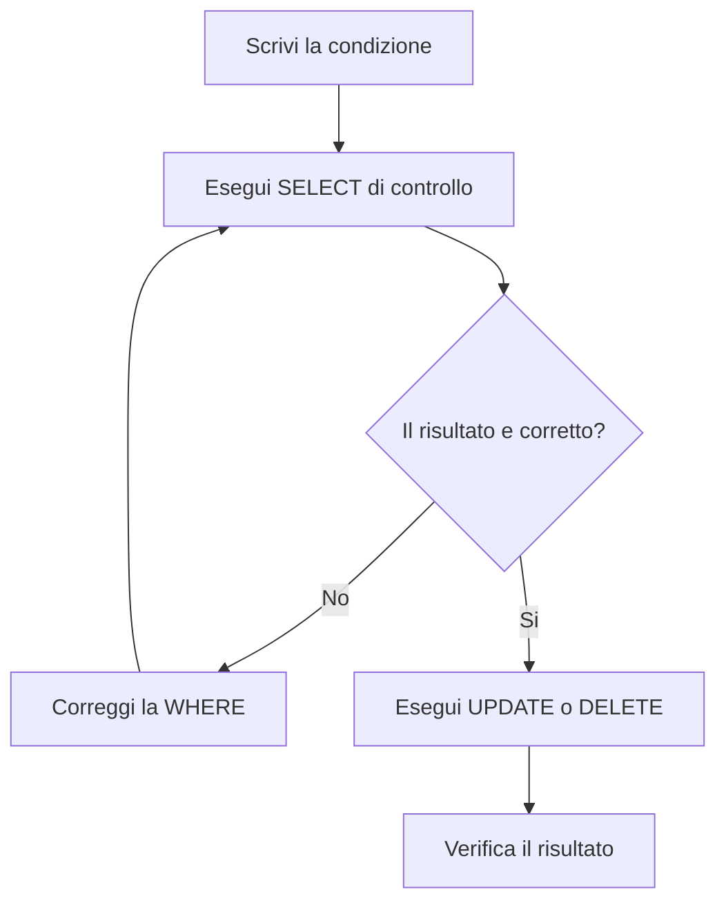

# 09 - Comandi DML

## Obiettivi della lezione

Al termine di questa unità il partecipante deve essere in grado di:

- spiegare a cosa servono i comandi DML;
- inserire record con `INSERT`;
- modificare record con `UPDATE`;
- cancellare record con `DELETE`;
- capire il ruolo della clausola `WHERE` in `UPDATE` e `DELETE`;
- evitare modifiche e cancellazioni involontarie su tutta la tabella.

---

## 1. Data Manipulation Language

I comandi **DML**, cioè **Data Manipulation Language**, permettono di inserire, modificare e cancellare record in una tabella.

Comandi principali:

| Comando | Operazione |
|---|---|
| `INSERT` | inserimento di nuovi record |
| `UPDATE` | modifica di record esistenti |
| `DELETE` | cancellazione di record esistenti |



---

## 2. Inserimento dati con `INSERT`

Per inserire un record in una tabella si usa il comando `INSERT`.

Sintassi generale:

```sql
INSERT INTO nome_tabella (nome_colonna1, nome_colonna2, ...)
VALUES (valore1, valore2, ...);
```

Esempio:

```sql
INSERT INTO lettori (nome, cognome, codice_fiscale, indirizzo, cap, citta, provincia)
VALUES ('Carlo', 'Rossi', 'CRLRSS23F45L354G', 'Via Roma', '00100', 'Roma', 'Rm');
```

Il principio è semplice:



La prima colonna indicata riceve il primo valore, la seconda colonna riceve il secondo valore, e così via. Se l'ordine non corrisponde, il DBMS non ha il dono della telepatia, nonostante molti sembrino crederlo.

---

## 3. Forma abbreviata di `INSERT`

Se si forniscono valori per **tutte** le colonne, nello stesso ordine in cui sono state definite nella tabella, si può usare una forma abbreviata:

```sql
INSERT INTO nome_tabella
VALUES (valore1, valore2, ...);
```

Questa forma è meno consigliabile nei laboratori iniziali, perché dipende rigidamente dall'ordine fisico delle colonne.

È preferibile indicare sempre i nomi delle colonne:

```sql
INSERT INTO lettori (nome, cognome, citta)
VALUES ('Massimo', 'Iovine', 'Roma');
```

---

## 4. Valori testuali e numerici

Regole di base:

| Tipo valore | Come si scrive |
|---|---|
| Testo `CHAR` / `VARCHAR` | tra apici singoli |
| Numeri interi | senza apici |
| Numeri decimali | senza apici, con il punto come separatore decimale |
| Booleani | senza apici, secondo la sintassi del DBMS |
| Date | spesso tra apici, nel formato previsto dal DBMS |

Esempi:

```sql
INSERT INTO prodotti (descrizione, prezzo, disponibile)
VALUES ('Mouse USB', 12.50, TRUE);
```

---

## 5. Esempio: inserimento in `LETTORI`

Tabella di riferimento:

| codice_lettore | nome | cognome | codice_fiscale | indirizzo | cap | citta | provincia |
|---:|---|---|---|---|---|---|---|
| 1 | Carlo | Rossi | CRLRSS23F45L354G | Via Roma | 00100 | Roma | Rm |
| 2 | Massimo | Iovine | MSSVNN12V56U323G | Via Ponte Vecchio | 00100 | Roma | Rm |

Se `codice_lettore` è `AUTO_INCREMENT`, non deve essere inserito manualmente.

```sql
INSERT INTO lettori (nome, cognome, codice_fiscale, indirizzo, cap, citta, provincia)
VALUES ('Carlo', 'Rossi', 'CRLRSS23F45L354G', 'Via Roma', '00100', 'Roma', 'Rm');

INSERT INTO lettori (nome, cognome, codice_fiscale, indirizzo, cap, citta, provincia)
VALUES ('Massimo', 'Iovine', 'MSSVNN12V56U323G', 'Via Ponte Vecchio', '00100', 'Roma', 'Rm');
```



---

## 6. Modifica dati con `UPDATE`

Per modificare uno o più record si usa il comando `UPDATE`.

Sintassi generale:

```sql
UPDATE nome_tabella
SET nome_colonna1 = nuovo_valore1,
    nome_colonna2 = nuovo_valore2
WHERE condizione_di_selezione;
```

Esempio:

```sql
UPDATE lettori
SET citta = 'Milano',
    provincia = 'Mi'
WHERE codice_lettore = 1;
```

La clausola `WHERE` indica quali record devono essere modificati.



---

## 7. Pericolo: `UPDATE` senza `WHERE`

Questo comando è pericoloso:

```sql
UPDATE lettori
SET citta = 'Milano';
```

Significa: modifica la città di **tutti** i lettori.

Il DBMS lo esegue, perché il DBMS non giudica. Si limita a obbedire, come ogni strumento abbastanza potente da rovinare un pomeriggio.

Prima di eseguire un `UPDATE`, conviene controllare i record interessati con una `SELECT`:

```sql
SELECT *
FROM lettori
WHERE codice_lettore = 1;
```

Poi si esegue:

```sql
UPDATE lettori
SET citta = 'Milano', provincia = 'Mi'
WHERE codice_lettore = 1;
```

---

## 8. Cancellazione dati con `DELETE`

Per cancellare uno o più record si usa il comando `DELETE`.

Sintassi generale:

```sql
DELETE FROM nome_tabella
WHERE condizione_di_selezione;
```

Esempio con chiave primaria:

```sql
DELETE FROM lettori
WHERE codice_lettore = 1;
```

Esempio con più condizioni:

```sql
DELETE FROM lettori
WHERE cognome = 'Rossi'
  AND nome = 'Carlo'
  AND citta = 'Roma';
```



---

## 9. Pericolo: `DELETE` senza `WHERE`

Questo comando cancella tutti i record della tabella:

```sql
DELETE FROM lettori;
```

Non elimina la struttura della tabella, ma svuota i dati.

| Comando | Effetto |
|---|---|
| `DELETE FROM lettori;` | cancella tutti i record, lascia la tabella esistente |
| `DROP TABLE lettori;` | elimina la tabella e la sua struttura |

Prima di cancellare, controllare sempre i record selezionati:

```sql
SELECT *
FROM lettori
WHERE codice_lettore = 1;
```

Solo dopo:

```sql
DELETE FROM lettori
WHERE codice_lettore = 1;
```

---

## 10. Sequenza consigliata prima di modificare o cancellare



---

## Sintesi finale

I comandi DML modificano i dati contenuti nelle tabelle. `INSERT` aggiunge record, `UPDATE` modifica record esistenti e `DELETE` cancella record. In `UPDATE` e `DELETE`, la clausola `WHERE` è fondamentale: senza di essa l'operazione viene applicata a tutta la tabella, con risultati spesso istruttivi ma raramente piacevoli.
