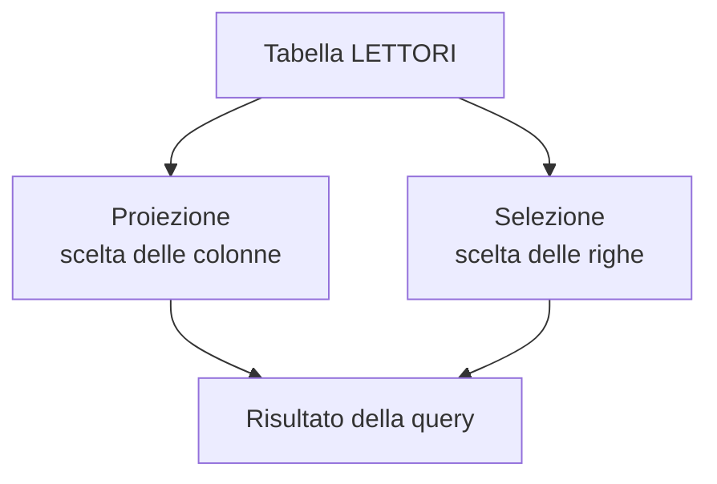
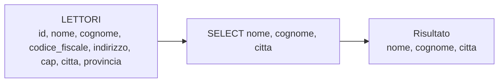
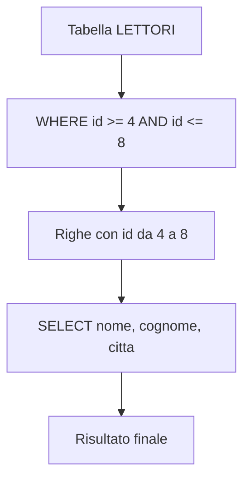
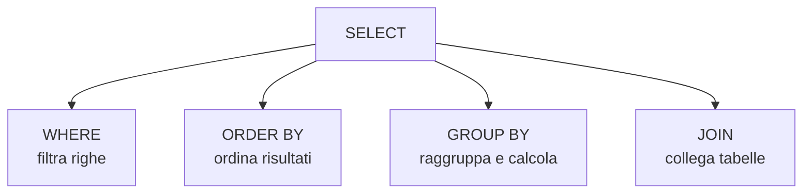

# 10 - Comandi DQL

## Obiettivi della lezione

Al termine di questa unità il partecipante deve essere in grado di:

- spiegare a cosa serve il comando `SELECT`;
- distinguere proiezione e selezione;
- scrivere una query di base;
- riconoscere le principali clausole usate con `SELECT`;
- capire quando usare `SELECT *` e quando indicare le colonne esplicitamente.

---

## 1. Data Query Language

I comandi **DQL**, cioè **Data Query Language**, permettono di interrogare un database.

Il comando principale è:

```sql
SELECT
```

Una query `SELECT` permette di ottenere un risultato composto da:

- colonne, scelte tramite **proiezione**;
- righe, scelte tramite **selezione**.



---

## 2. Tabella di esempio

Useremo come riferimento una tabella `LETTORI` semplificata.

| id | nome | cognome | codice_fiscale | indirizzo | cap | citta | provincia |
|---:|---|---|---|---|---|---|---|
| 1 | Carlo | Rossi | CRLRSS23F45L354G | Via Roma | 00100 | Roma | Rm |
| 2 | Giuseppe | Bianchi | GPPBNC... | Via Capannelle | 80121 | Napoli | Na |
| 3 | Antonella | Verdi | NTNVRD... | Via del Mirto | 90128 | Palermo | Pa |
| 4 | Roberta | Bonelli | RBRBNL... | Via dei Gracchi | 10123 | Torino | To |
| 5 | Manuel | Manzo | MNL... | Via Napoleone | 20135 | Milano | Mi |
| 6 | Michele | Perna | MCL... | Via Camaldoli | 50121 | Firenze | Fi |
| 7 | Massimo | Iovine | MSS... | Via Ponte Vecchio | 00138 | Roma | Rm |
| 8 | Giulio | Rossi | GLR... | Via del Mare | 20133 | Milano | Mi |
| 9 | Paolo | Calazzo | PLC... | Via di Somma | 80143 | Salerno | Sa |
| 10 | Mario | Bianchi | MRR... | Via Veneto | 80121 | Napoli | Na |

---

## 3. Proiezione

La **proiezione** indica quali colonne vogliamo vedere nel risultato.

Esempio:

```sql
SELECT nome, cognome, citta
FROM lettori;
```

Questa query non mostra tutte le colonne, ma solo:

- `nome`;
- `cognome`;
- `citta`.



---

## 4. Selezione

La **selezione** indica quali righe vogliamo ottenere.

Esempio:

```sql
SELECT nome, cognome, citta
FROM lettori
WHERE id >= 4 AND id <= 8;
```

La clausola `WHERE` filtra le righe.

Risultato atteso:

| nome | cognome | citta |
|---|---|---|
| Roberta | Bonelli | Torino |
| Manuel | Manzo | Milano |
| Michele | Perna | Firenze |
| Massimo | Iovine | Roma |
| Giulio | Rossi | Milano |



---

## 5. Struttura generale di una query `SELECT`

Sintassi generale:

```sql
SELECT nome_colonna1, nome_colonna2, ...
FROM nome_tabella
[clausole];
```

Esempio:

```sql
SELECT nome, cognome
FROM lettori
WHERE citta = 'Roma'
ORDER BY cognome, nome;
```

---

## 6. `SELECT *`

Se si vogliono visualizzare tutte le colonne, si può usare:

```sql
SELECT *
FROM nome_tabella;
```

Esempio:

```sql
SELECT *
FROM lettori;
```

`SELECT *` è comodo nelle prove rapide, ma nei progetti reali è spesso meglio indicare esplicitamente le colonne:

```sql
SELECT nome, cognome, citta
FROM lettori;
```

Motivi:

- il risultato è più leggibile;
- si trasferiscono solo i dati necessari;
- il codice è meno fragile se la tabella cambia struttura.

---

## 7. Principali clausole di `SELECT`

| Clausola | Uso principale |
|---|---|
| `ORDER BY` | ordina le righe del risultato |
| `WHERE` | filtra le righe in base a condizioni |
| `GROUP BY` | raggruppa righe e calcola subtotali o aggregazioni |
| `JOIN` | collega dati provenienti da più tabelle |



---

## 8. Lettura guidata della query

Query:

```sql
SELECT nome, cognome, citta
FROM lettori
WHERE id >= 4 AND id <= 8;
```

Lettura passo passo:

| Parte della query | Significato |
|---|---|
| `SELECT nome, cognome, citta` | mostra solo queste colonne |
| `FROM lettori` | usa la tabella `lettori` |
| `WHERE id >= 4 AND id <= 8` | seleziona solo le righe con id da 4 a 8 |

---

## Sintesi finale

Il comando `SELECT` serve a interrogare il database. La proiezione sceglie le colonne, la selezione sceglie le righe. Le clausole `WHERE`, `ORDER BY`, `GROUP BY` e `JOIN` permettono di costruire interrogazioni più precise e utili.
