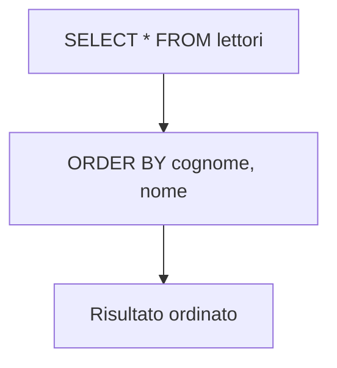
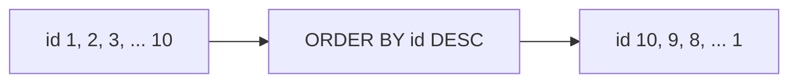
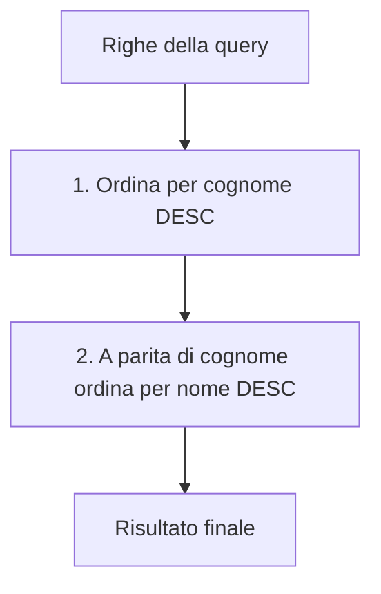
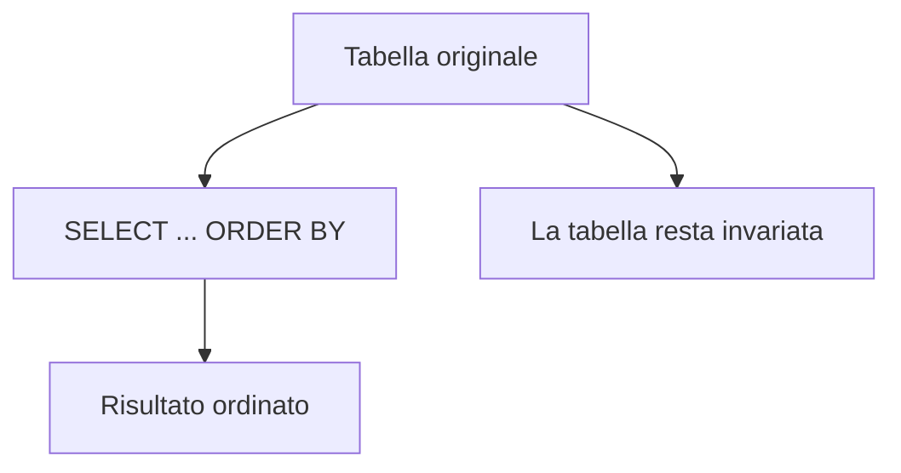

# 11 - DQL: clausola ORDER BY

## Obiettivi della lezione

Al termine di questa unità il partecipante deve essere in grado di:

- spiegare a cosa serve `ORDER BY`;
- ordinare i risultati in modo crescente e decrescente;
- usare più colonne come chiavi di ordinamento;
- distinguere l'ordinamento del risultato dalla struttura fisica della tabella.

---

## 1. A cosa serve `ORDER BY`

La clausola `ORDER BY` serve a ordinare le righe restituite da una query `SELECT`.

Sintassi generale:

```sql
SELECT colonne
FROM tabella
ORDER BY colonna1, colonna2;
```

Esempio:

```sql
SELECT *
FROM lettori
ORDER BY cognome, nome;
```

La query ordina prima per `cognome` e, a parità di cognome, per `nome`.



---

## 2. Ordinamento crescente

Se non si specifica nulla, l'ordinamento è crescente.

Queste due query sono equivalenti:

```sql
SELECT *
FROM lettori
ORDER BY cognome, nome;
```

```sql
SELECT *
FROM lettori
ORDER BY cognome ASC, nome ASC;
```

`ASC` significa **ascending**, cioè crescente.

Esempio di ordinamento per cognome e nome:

| id | nome | cognome | citta |
|---:|---|---|---|
| 10 | Mario | Bianchi | Napoli |
| 2 | Giuseppe | Bianchi | Napoli |
| 4 | Roberta | Bonelli | Torino |
| 9 | Paolo | Calazzo | Salerno |
| 7 | Massimo | Iovine | Roma |
| 5 | Manuel | Manzo | Milano |
| 6 | Michele | Perna | Firenze |
| 1 | Carlo | Rossi | Roma |
| 8 | Giulio | Rossi | Milano |
| 3 | Antonella | Verdi | Palermo |

Nota: l'ordine tra `Giuseppe Bianchi` e `Mario Bianchi` dipende dalla seconda chiave `nome`.

---

## 3. Ordinamento decrescente

Per ordinare in modo decrescente si usa `DESC`.

```sql
SELECT *
FROM lettori
ORDER BY id DESC;
```

Risultato concettuale:

| id | nome | cognome | citta |
|---:|---|---|---|
| 10 | Mario | Bianchi | Napoli |
| 9 | Paolo | Calazzo | Salerno |
| 8 | Giulio | Rossi | Milano |
| 7 | Massimo | Iovine | Roma |
| 6 | Michele | Perna | Firenze |
| 5 | Manuel | Manzo | Milano |
| 4 | Roberta | Bonelli | Torino |
| 3 | Antonella | Verdi | Palermo |
| 2 | Giuseppe | Bianchi | Napoli |
| 1 | Carlo | Rossi | Roma |



---

## 4. Ordinamento su più colonne

È possibile ordinare usando più colonne.

```sql
SELECT id, nome, cognome
FROM lettori
ORDER BY cognome DESC, nome DESC;
```

Significa:

1. ordina per `cognome` in modo decrescente;
2. se più righe hanno lo stesso `cognome`, ordina quelle righe per `nome` in modo decrescente.



Esempio:

| id | nome | cognome |
|---:|---|---|
| 3 | Antonella | Verdi |
| 8 | Giulio | Rossi |
| 1 | Carlo | Rossi |
| 6 | Michele | Perna |
| 5 | Manuel | Manzo |
| 7 | Massimo | Iovine |
| 9 | Paolo | Calazzo |
| 4 | Roberta | Bonelli |
| 10 | Mario | Bianchi |
| 2 | Giuseppe | Bianchi |

---

## 5. `ORDER BY` non modifica la tabella

`ORDER BY` ordina il **risultato della query**, non cambia la disposizione fisica dei record nella tabella.



Questo punto è importante: una query legge e presenta i dati in un certo ordine, ma non riscrive la tabella.

---

## 6. Sintassi riassuntiva

| Sintassi | Effetto |
|---|---|
| `ORDER BY cognome` | ordina per cognome crescente |
| `ORDER BY cognome ASC` | ordina per cognome crescente |
| `ORDER BY cognome DESC` | ordina per cognome decrescente |
| `ORDER BY cognome, nome` | ordina per cognome e poi per nome |
| `ORDER BY cognome DESC, nome DESC` | ordina entrambe le colonne in modo decrescente |

---

## Sintesi finale

`ORDER BY` serve a ordinare le righe prodotte da una `SELECT`. L'ordinamento può essere crescente con `ASC` o decrescente con `DESC`. Si possono usare più colonne come chiavi di ordinamento. La tabella originale non viene modificata: cambia solo il modo in cui il risultato viene presentato.
