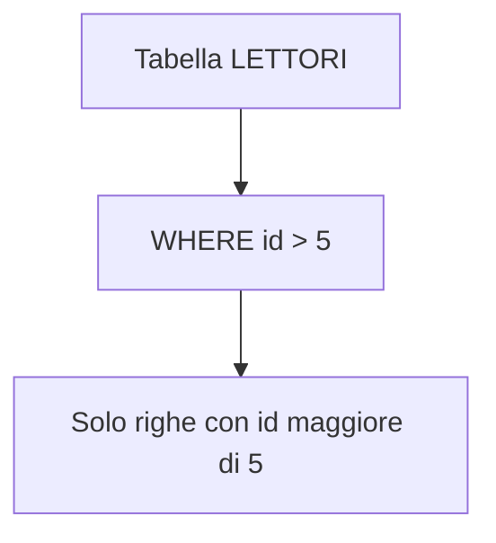
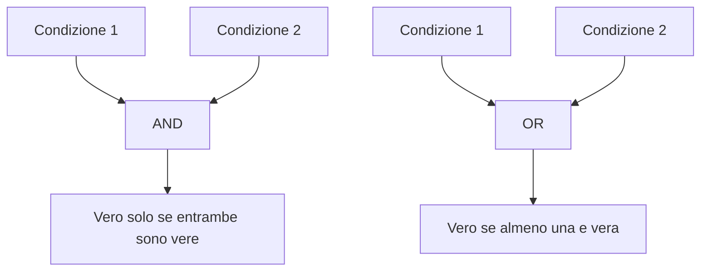
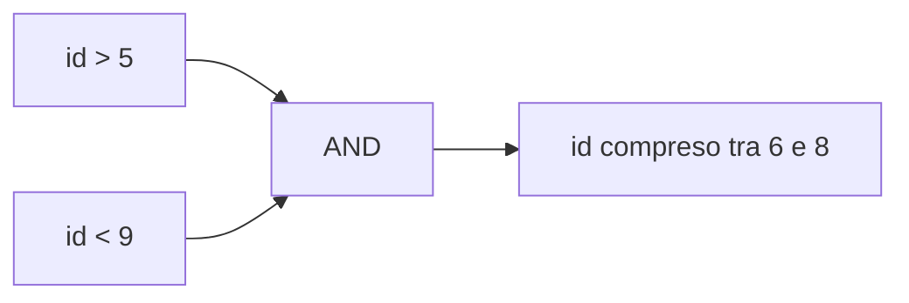
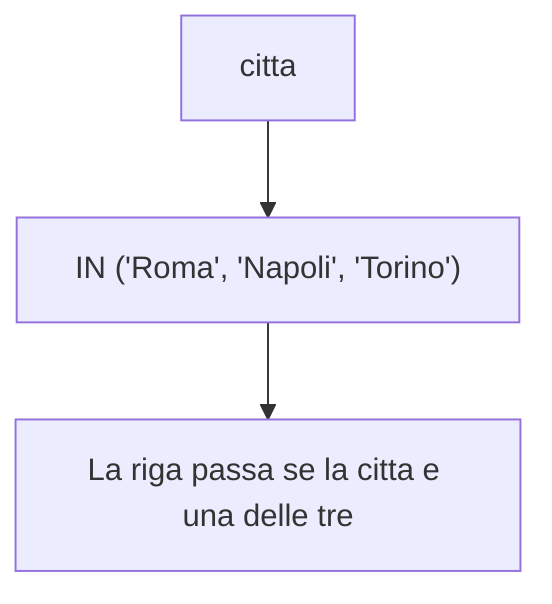
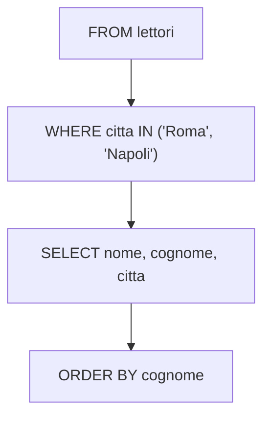

# 12 - DQL: clausola WHERE

## Obiettivi della lezione

Al termine di questa unità il partecipante deve essere in grado di:

- spiegare a cosa serve `WHERE`;
- usare operatori relazionali nelle condizioni;
- combinare più condizioni con operatori logici;
- usare `BETWEEN`, `IN` e `LIKE`;
- leggere il risultato atteso di una query filtrata.

---

## 1. A cosa serve `WHERE`

La clausola `WHERE` serve a selezionare solo le righe che rispettano una o più condizioni.

Sintassi generale:

```sql
SELECT colonne
FROM tabella
WHERE condizione;
```

Esempio:

```sql
SELECT *
FROM lettori
WHERE id > 5;
```



---

## 2. Operatori relazionali

| Operatore | Significato | Esempio |
|---|---|---|
| `=` | uguale a | `nome = 'Massimo'` |
| `>` | maggiore di | `id > 10` |
| `<` | minore di | `id < 20` |
| `>=` | maggiore o uguale a | `eta >= 25` |
| `<=` | minore o uguale a | `id <= 40` |
| `<>` | diverso da | `citta <> 'Milano'` |

Esempio:

```sql
SELECT *
FROM lettori
WHERE cognome = 'Rossi';
```

---

## 3. Operatori logici

Più condizioni possono essere combinate tra loro.

| Operatore | Significato |
|---|---|
| `AND` | tutte le condizioni devono essere vere |
| `OR` | almeno una condizione deve essere vera |
| `NOT` | nega una condizione |
| `BETWEEN` | verifica un intervallo, estremi inclusi |
| `LIKE` | confronta stringhe tramite pattern |
| `IN` | verifica se un valore appartiene a un elenco |



---

## 4. Esempio con `>`

Query:

```sql
SELECT *
FROM lettori
WHERE id > 5;
```

Risultato concettuale:

| id | nome | cognome | citta | provincia |
|---:|---|---|---|---|
| 6 | Michele | Perna | Firenze | Fi |
| 7 | Massimo | Iovine | Roma | Rm |
| 8 | Giulio | Rossi | Milano | Mi |
| 9 | Paolo | Calazzo | Salerno | Sa |
| 10 | Mario | Bianchi | Napoli | Na |

---

## 5. Esempio con `AND`

Query:

```sql
SELECT nome, cognome, citta, provincia
FROM lettori
WHERE id > 5 AND id < 9;
```

Risultato:

| nome | cognome | citta | provincia |
|---|---|---|---|
| Michele | Perna | Firenze | Fi |
| Massimo | Iovine | Roma | Rm |
| Giulio | Rossi | Milano | Mi |

La riga viene selezionata solo se entrambe le condizioni sono vere:



---

## 6. Esempio equivalente con `BETWEEN`

La query precedente può essere scritta anche così:

```sql
SELECT nome, cognome, citta, provincia
FROM lettori
WHERE id BETWEEN 6 AND 8;
```

`BETWEEN` include gli estremi: in questo caso include `6`, `7` e `8`.

---

## 7. Esempio con uguaglianza su stringa

Query:

```sql
SELECT *
FROM lettori
WHERE citta = 'Roma';
```

Risultato:

| id | nome | cognome | citta | provincia |
|---:|---|---|---|---|
| 1 | Carlo | Rossi | Roma | Rm |
| 7 | Massimo | Iovine | Roma | Rm |

Attenzione: la gestione di maiuscole/minuscole dipende dal DBMS e dalla collation configurata. In alcuni sistemi `'Roma'` e `'ROMA'` possono essere considerati uguali, in altri no.

---

## 8. Esempio con `OR`

Query:

```sql
SELECT nome, cognome, citta, provincia
FROM lettori
WHERE citta = 'Roma'
   OR citta = 'Napoli'
   OR citta = 'Torino';
```

Risultato:

| nome | cognome | citta | provincia |
|---|---|---|---|
| Carlo | Rossi | Roma | Rm |
| Giuseppe | Bianchi | Napoli | Na |
| Roberta | Bonelli | Torino | To |
| Massimo | Iovine | Roma | Rm |
| Mario | Bianchi | Napoli | Na |

---

## 9. Esempio equivalente con `IN`

La query precedente può essere scritta in modo più compatto con `IN`:

```sql
SELECT nome, cognome, citta, provincia
FROM lettori
WHERE citta IN ('Roma', 'Napoli', 'Torino');
```



---

## 10. Esempio con `LIKE`

`LIKE` serve a cercare una stringa usando un pattern.

Query:

```sql
SELECT nome, cognome, codice_fiscale, citta, provincia
FROM lettori
WHERE codice_fiscale LIKE '%RSS%';
```

`%` significa: qualunque sequenza di caratteri.

Quindi `'%RSS%'` significa: contiene la sequenza `RSS` in qualunque posizione.

Risultato concettuale:

| nome | cognome | codice_fiscale | citta | provincia |
|---|---|---|---|---|
| Carlo | Rossi | CRLRSS23F45L354G | Roma | Rm |
| Giulio | Rossi | GLRRSS... | Milano | Mi |

---

## 11. Pattern comuni con `LIKE`

| Pattern | Significato |
|---|---|
| `'Ros%'` | inizia con `Ros` |
| `'%ssi'` | termina con `ssi` |
| `'%RSS%'` | contiene `RSS` |
| `'R_ssi'` | `_` indica un singolo carattere qualsiasi |

Esempi:

```sql
SELECT *
FROM lettori
WHERE cognome LIKE 'Ros%';

SELECT *
FROM lettori
WHERE cognome LIKE '%ssi';
```

---

## 12. Ordine logico di lettura

Query:

```sql
SELECT nome, cognome, citta
FROM lettori
WHERE citta IN ('Roma', 'Napoli')
ORDER BY cognome;
```

Lettura concettuale:



---

## Sintesi finale

`WHERE` permette di filtrare le righe di una tabella. Gli operatori relazionali costruiscono condizioni semplici, mentre `AND`, `OR`, `NOT`, `BETWEEN`, `IN` e `LIKE` permettono di costruire filtri più espressivi. Una buona `WHERE` è la differenza tra una query precisa e una richiesta lanciata nel vuoto cosmico del database.
