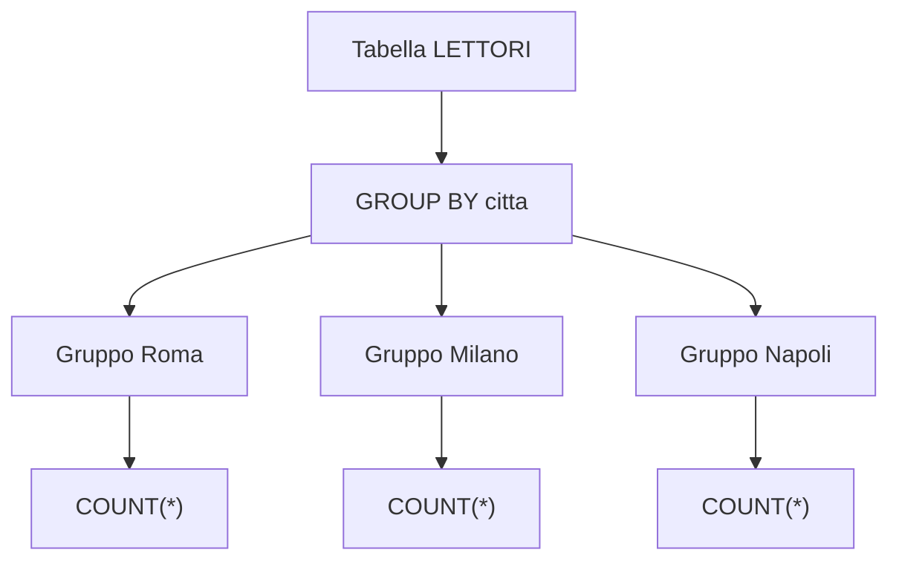
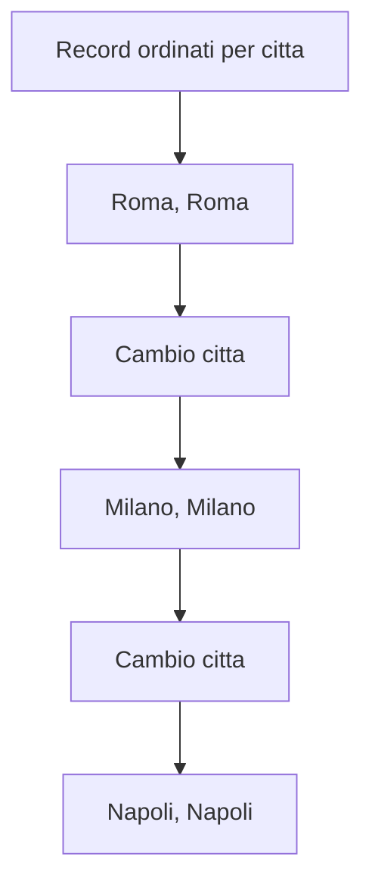
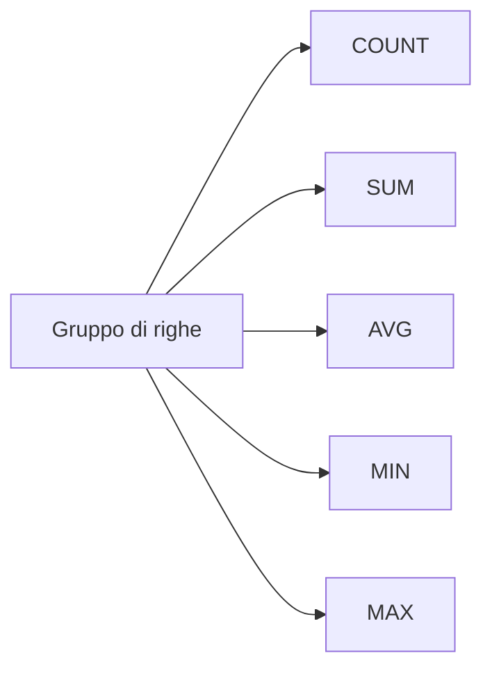
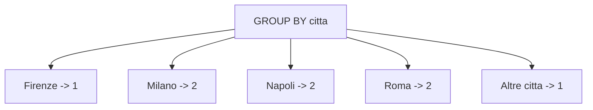
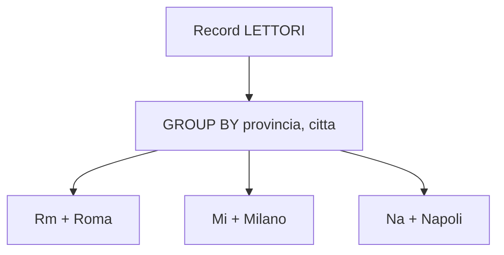

# 13 - DQL: clausola GROUP BY

## Obiettivi della lezione

Al termine di questa unità il partecipante deve essere in grado di:

- spiegare a cosa serve `GROUP BY`;
- distinguere righe dettagliate e righe aggregate;
- usare funzioni di aggregazione come `COUNT`, `SUM`, `AVG`, `MIN`, `MAX`;
- scrivere una query con raggruppamento;
- capire perché le colonne in `SELECT` devono essere coerenti con il raggruppamento.

---

## 1. A cosa serve `GROUP BY`

La clausola `GROUP BY` serve a raggruppare più righe in base a una o più colonne e calcolare valori aggregati per ogni gruppo.

Esempio:

```sql
SELECT citta, COUNT(*) AS numero_lettori
FROM lettori
GROUP BY citta;
```

Questa query conta quanti lettori ci sono per ogni città.



---

## 2. Rottura di codice

Nei materiali tradizionali il raggruppamento viene spesso spiegato con il concetto di **rottura di codice**.

L'idea è questa:

1. i record vengono ordinati per la chiave di raggruppamento;
2. finché la chiave resta uguale, i record appartengono allo stesso gruppo;
3. quando la chiave cambia, termina un gruppo e ne inizia un altro.



Il DBMS non ha bisogno che noi ordiniamo manualmente i dati prima del `GROUP BY`, ma il concetto aiuta a capire cosa succede logicamente.

---

## 3. Tabella di esempio

| id | nome | cognome | citta | provincia |
|---:|---|---|---|---|
| 1 | Carlo | Rossi | Roma | Rm |
| 2 | Giuseppe | Bianchi | Napoli | Na |
| 3 | Antonella | Verdi | Palermo | Pa |
| 4 | Roberta | Bonelli | Torino | To |
| 5 | Manuel | Manzo | Milano | Mi |
| 6 | Michele | Perna | Firenze | Fi |
| 7 | Massimo | Iovine | Roma | Rm |
| 8 | Giulio | Rossi | Milano | Mi |
| 9 | Paolo | Calazzo | Salerno | Sa |
| 10 | Mario | Bianchi | Napoli | Na |

Raggruppando per `citta`, si ottengono gruppi come:

| citta | lettori nel gruppo |
|---|---|
| Roma | Carlo Rossi, Massimo Iovine |
| Milano | Manuel Manzo, Giulio Rossi |
| Napoli | Giuseppe Bianchi, Mario Bianchi |
| Palermo | Antonella Verdi |
| Torino | Roberta Bonelli |
| Firenze | Michele Perna |
| Salerno | Paolo Calazzo |

---

## 4. Funzioni di aggregazione

Le funzioni di aggregazione calcolano un valore a partire da più righe.

| Funzione | Significato | Note |
|---|---|---|
| `COUNT(*)` | conta le righe | funziona su qualunque tabella |
| `COUNT(colonna)` | conta i valori non nulli della colonna | ignora i valori `NULL` |
| `SUM(colonna)` | somma i valori | solo colonne numeriche |
| `AVG(colonna)` | calcola la media | solo colonne numeriche |
| `MIN(colonna)` | trova il valore minimo | numeri, date, stringhe secondo ordinamento |
| `MAX(colonna)` | trova il valore massimo | numeri, date, stringhe secondo ordinamento |



---

## 5. Esempio con `COUNT(*)`

Query:

```sql
SELECT citta AS citta,
       COUNT(*) AS numero_lettori
FROM lettori
GROUP BY citta;
```

Risultato:

| citta | numero_lettori |
|---|---:|
| Firenze | 1 |
| Milano | 2 |
| Napoli | 2 |
| Palermo | 1 |
| Roma | 2 |
| Salerno | 1 |
| Torino | 1 |



---

## 6. Alias delle colonne

Un alias assegna un nome più leggibile a una colonna del risultato.

```sql
SELECT citta AS citta,
       COUNT(*) AS numero_lettori
FROM lettori
GROUP BY citta;
```

In molti DBMS è possibile usare anche le virgolette o gli apici doppi per alias con spazi:

```sql
SELECT citta AS "Citta",
       COUNT(*) AS "Numero lettori"
FROM lettori
GROUP BY citta;
```

È preferibile usare alias semplici, senza spazi, soprattutto nei laboratori iniziali:

```sql
SELECT citta AS citta,
       COUNT(*) AS numero_lettori
FROM lettori
GROUP BY citta;
```

---

## 7. Regola importante sulle colonne selezionate

Quando si usa `GROUP BY`, nella `SELECT` possono comparire:

- colonne presenti nel `GROUP BY`;
- funzioni di aggregazione.

Esempio corretto:

```sql
SELECT citta, COUNT(*) AS numero_lettori
FROM lettori
GROUP BY citta;
```

Esempio problematico:

```sql
SELECT citta, nome, COUNT(*) AS numero_lettori
FROM lettori
GROUP BY citta;
```
---
Perché è problematico? Perché per ogni città esistono più nomi. Il DBMS non può sapere quale `nome` mostrare per il gruppo.


## 8. Esempio con più colonne di raggruppamento

È possibile raggruppare per più colonne.

```sql
SELECT provincia, citta, COUNT(*) AS numero_lettori
FROM lettori
GROUP BY provincia, citta;
```

Significa: crea un gruppo per ogni coppia `provincia` + `citta`.



---

## 9. `GROUP BY` e `ORDER BY`

`GROUP BY` raggruppa. `ORDER BY` ordina il risultato.

```sql
SELECT citta, COUNT(*) AS numero_lettori
FROM lettori
GROUP BY citta
ORDER BY numero_lettori DESC, citta;
```

Risultato concettuale:

| citta | numero_lettori |
|---|---:|
| Milano | 2 |
| Napoli | 2 |
| Roma | 2 |
| Firenze | 1 |
| Palermo | 1 |
| Salerno | 1 |
| Torino | 1 |

---

## Sintesi finale

`GROUP BY` raggruppa le righe che hanno lo stesso valore in una o più colonne. Le funzioni di aggregazione calcolano valori sintetici per ogni gruppo. È fondamentale distinguere il dettaglio dei singoli record dal risultato aggregato: una volta raggruppati i dati, non si sta più guardando la singola riga, ma il gruppo.
