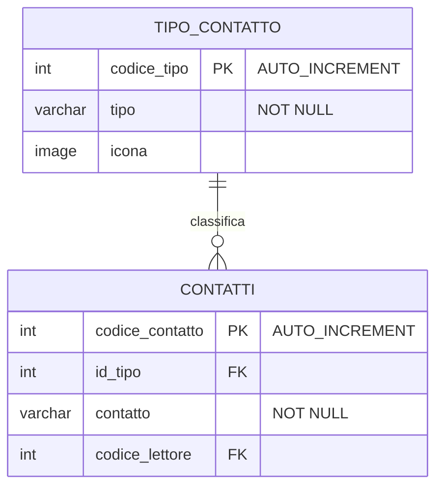
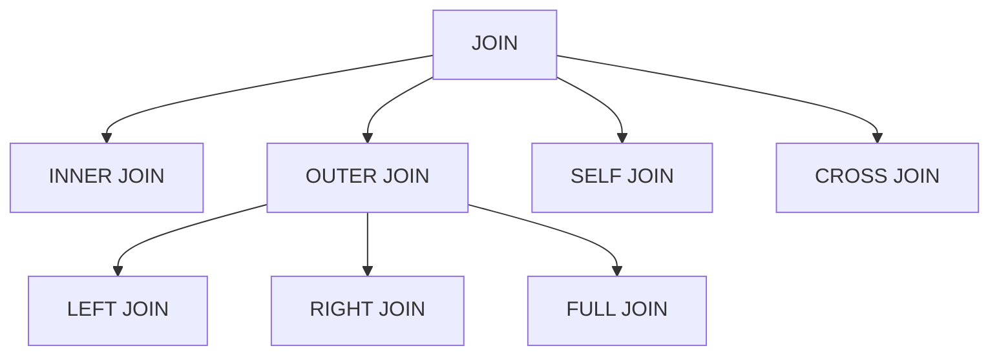
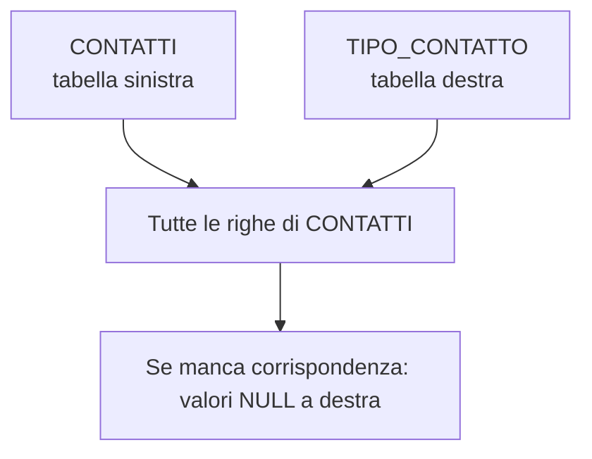
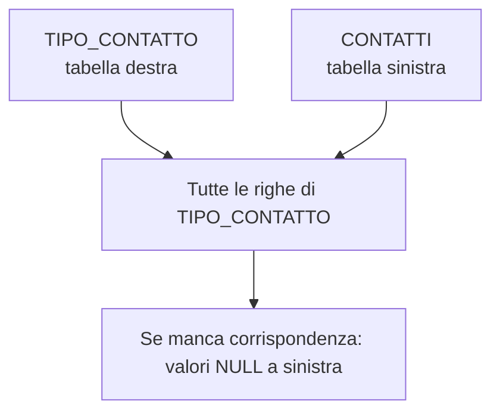
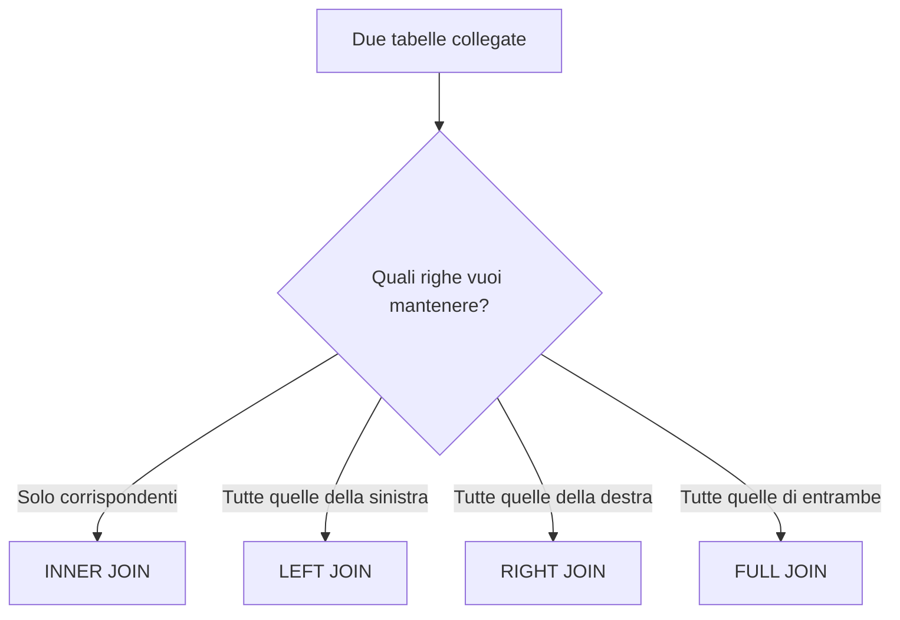
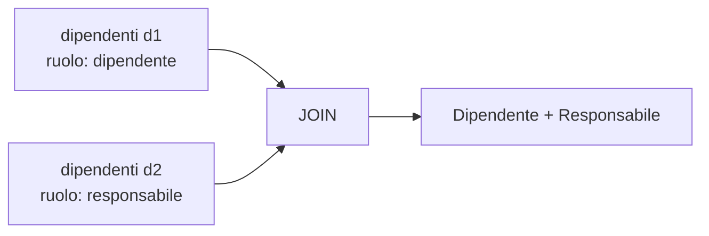
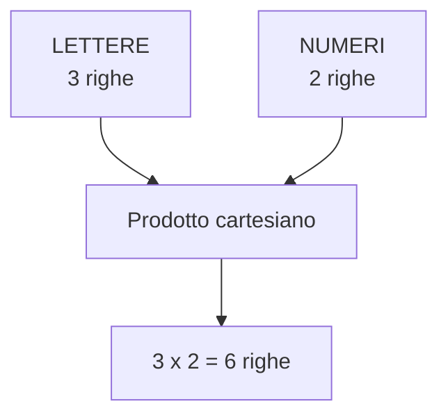

# 14 - DQL: clausola JOIN

## Obiettivi della lezione

Al termine di questa unità il partecipante deve essere in grado di:

- spiegare a cosa serve una `JOIN`;
- collegare tabelle tramite chiavi primarie e chiavi esterne;
- distinguere `INNER JOIN`, `LEFT JOIN`, `RIGHT JOIN`, `FULL JOIN`, `SELF JOIN` e `CROSS JOIN`;
- leggere il risultato prodotto dai principali tipi di join;
- riconoscere quando usare alias di tabella.

---

## 1. A cosa serve una JOIN

Una `JOIN` permette di ottenere un risultato combinando dati presenti in più tabelle.

Di solito il collegamento avviene tra:

- una chiave primaria della tabella principale;
- una chiave esterna della tabella collegata.



Esempio:

```sql
SELECT contatti.contatto,
       tipo_contatto.tipo
FROM contatti
INNER JOIN tipo_contatto
    ON tipo_contatto.codice_tipo = contatti.id_tipo;
```

---

## 2. Tabelle di esempio

Tabella `TIPO_CONTATTO`:

| codice_tipo | tipo |
|---:|---|
| 1 | Facebook |
| 2 | Skype |
| 3 | LinkedIn |
| 4 | Google+ |

Tabella `CONTATTI`:

| codice_contatto | id_tipo | contatto | codice_lettore |
|---:|---:|---|---:|
| 1 | 1 | FB/Rossi | 1 |
| 2 | 1 | FB/Manzo | 5 |
| 3 | 2 | SK/Verdi | 3 |
| 4 | 3 | LK/Bianchi | 2 |
| 5 | NULL | Mail/Perna | 6 |

Queste tabelle permettono di mostrare i diversi comportamenti delle join.

---

## 3. Tipi principali di JOIN

| Tipo di join | Risultato principale |
|---|---|
| `INNER JOIN` | solo righe con corrispondenza in entrambe le tabelle |
| `LEFT JOIN` | tutte le righe della tabella sinistra più le corrispondenze della destra |
| `RIGHT JOIN` | tutte le righe della tabella destra più le corrispondenze della sinistra |
| `FULL JOIN` | tutte le righe di entrambe le tabelle, con o senza corrispondenza |
| `SELF JOIN` | una tabella collegata a sé stessa |
| `CROSS JOIN` | prodotto cartesiano tra due tabelle |



---

## 4. INNER JOIN

`INNER JOIN` restituisce solo le righe per cui esiste una corrispondenza tra le due tabelle.

```sql
SELECT contatti.contatto,
       tipo_contatto.tipo
FROM contatti
INNER JOIN tipo_contatto
    ON tipo_contatto.codice_tipo = contatti.id_tipo;
```

Risultato:

| contatto | tipo |
|---|---|
| FB/Rossi | Facebook |
| FB/Manzo | Facebook |
| SK/Verdi | Skype |
| LK/Bianchi | LinkedIn |

La riga `Mail/Perna` non compare perché `id_tipo` è `NULL`, quindi non trova una corrispondenza in `TIPO_CONTATTO`.


---

## 5. LEFT JOIN

`LEFT JOIN` restituisce tutte le righe della tabella a sinistra della join e, quando esiste, il valore corrispondente della tabella a destra.

```sql
SELECT contatti.contatto,
       tipo_contatto.tipo
FROM contatti
LEFT JOIN tipo_contatto
    ON tipo_contatto.codice_tipo = contatti.id_tipo;
```

Risultato:

| contatto | tipo |
|---|---|
| FB/Rossi | Facebook |
| FB/Manzo | Facebook |
| SK/Verdi | Skype |
| LK/Bianchi | LinkedIn |
| Mail/Perna | NULL |



---

## 6. RIGHT JOIN

`RIGHT JOIN` restituisce tutte le righe della tabella a destra della join e, quando esiste, il valore corrispondente della tabella a sinistra.

```sql
SELECT contatti.contatto,
       tipo_contatto.tipo
FROM contatti
RIGHT JOIN tipo_contatto
    ON tipo_contatto.codice_tipo = contatti.id_tipo;
```

Risultato:

| contatto | tipo |
|---|---|
| FB/Rossi | Facebook |
| FB/Manzo | Facebook |
| SK/Verdi | Skype |
| LK/Bianchi | LinkedIn |
| NULL | Google+ |

La riga `Google+` compare anche se nessun contatto usa quel tipo.



---

## 7. FULL JOIN

`FULL JOIN` restituisce tutte le righe di entrambe le tabelle:

- quelle con corrispondenza;
- quelle presenti solo nella tabella sinistra;
- quelle presenti solo nella tabella destra.

```sql
SELECT contatti.contatto,
       tipo_contatto.tipo
FROM contatti
FULL JOIN tipo_contatto
    ON tipo_contatto.codice_tipo = contatti.id_tipo;
```

Risultato concettuale:

| contatto | tipo |
|---|---|
| FB/Rossi | Facebook |
| FB/Manzo | Facebook |
| SK/Verdi | Skype |
| LK/Bianchi | LinkedIn |
| Mail/Perna | NULL |
| NULL | Google+ |

Nota: MySQL/MariaDB non supportano direttamente `FULL JOIN`. In questi DBMS si può ottenere un risultato simile combinando `LEFT JOIN` e `RIGHT JOIN` con `UNION`.

```sql
SELECT contatti.contatto,
       tipo_contatto.tipo
FROM contatti
LEFT JOIN tipo_contatto
    ON tipo_contatto.codice_tipo = contatti.id_tipo
UNION
SELECT contatti.contatto,
       tipo_contatto.tipo
FROM contatti
RIGHT JOIN tipo_contatto
    ON tipo_contatto.codice_tipo = contatti.id_tipo;
```

---

## 8. Differenza sintetica tra INNER, LEFT, RIGHT e FULL



| Tipo | Mantiene righe senza corrispondenza? | Da quale lato? |
|---|---|---|
| `INNER JOIN` | No | nessuno |
| `LEFT JOIN` | Sì | tabella sinistra |
| `RIGHT JOIN` | Sì | tabella destra |
| `FULL JOIN` | Sì | entrambe |

---

## 9. SELF JOIN

Una `SELF JOIN` collega una tabella con sé stessa.

È utile quando una tabella contiene una relazione interna, ad esempio dipendente-responsabile.

Tabella `DIPENDENTI`:

| id | dipendente | id_responsabile |
|---:|---|---:|
| 1 | Rossi | NULL |
| 2 | Verdi | 1 |
| 3 | Bianchi | 1 |
| 4 | Neri | 2 |
| 5 | Manzo | 2 |

Query:

```sql
SELECT d1.id AS id,
       d1.dipendente AS dipendente,
       d2.dipendente AS responsabile
FROM dipendenti d1
LEFT JOIN dipendenti d2
    ON d1.id_responsabile = d2.id;
```

Risultato:

| id | dipendente | responsabile |
|---:|---|---|
| 1 | Rossi | NULL |
| 2 | Verdi | Rossi |
| 3 | Bianchi | Rossi |
| 4 | Neri | Verdi |
| 5 | Manzo | Verdi |

Gli alias `d1` e `d2` sono indispensabili per distinguere i due ruoli della stessa tabella.



---

## 10. CROSS JOIN

`CROSS JOIN` produce il **prodotto cartesiano** tra due tabelle.

Significa che ogni riga della prima tabella viene combinata con ogni riga della seconda.

Tabella `LETTERE`:

| lettera |
|---|
| A |
| B |
| C |

Tabella `NUMERI`:

| numero |
|---:|
| 10 |
| 20 |

Query:

```sql
SELECT lettere.lettera,
       numeri.numero
FROM lettere
CROSS JOIN numeri;
```

Risultato:

| lettera | numero |
|---|---:|
| A | 10 |
| A | 20 |
| B | 10 |
| B | 20 |
| C | 10 |
| C | 20 |



Attenzione: su tabelle grandi il risultato può esplodere rapidamente. Due tabelle da 10.000 righe producono 100.000.000 combinazioni. La matematica, quando vuole, sa essere vendicativa.

---

## 11. Uso degli alias

Gli alias rendono più breve e leggibile una query.

Senza alias:

```sql
SELECT contatti.contatto,
       tipo_contatto.tipo
FROM contatti
INNER JOIN tipo_contatto
    ON tipo_contatto.codice_tipo = contatti.id_tipo;
```

Con alias:

```sql
SELECT c.contatto,
       t.tipo
FROM contatti c
INNER JOIN tipo_contatto t
    ON t.codice_tipo = c.id_tipo;
```

Gli alias diventano quasi obbligatori quando:

- si lavora con tabelle con nomi lunghi;
- si usano più join;
- si fa una self join;
- più tabelle hanno colonne con lo stesso nome.

---

## Sintesi finale

Le join permettono di combinare dati distribuiti su più tabelle. `INNER JOIN` mostra solo le corrispondenze, `LEFT JOIN` mantiene tutte le righe della tabella sinistra, `RIGHT JOIN` quelle della tabella destra, `FULL JOIN` entrambe. `SELF JOIN` collega una tabella a sé stessa, mentre `CROSS JOIN` produce il prodotto cartesiano. Saper scegliere la join giusta evita risultati incompleti o, peggio, tabelle gigantesche create per puro entusiasmo distruttivo.
