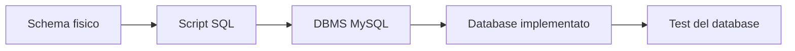
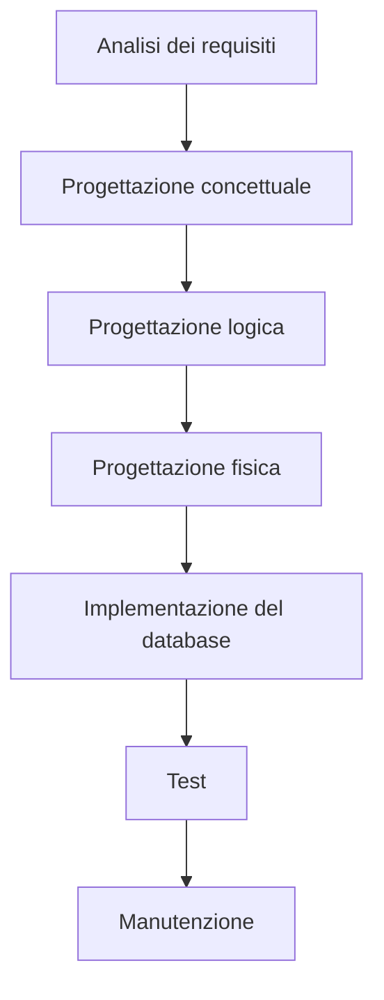
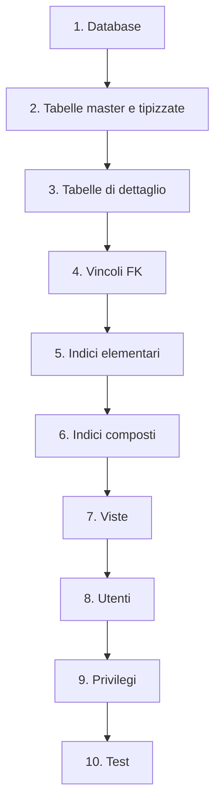
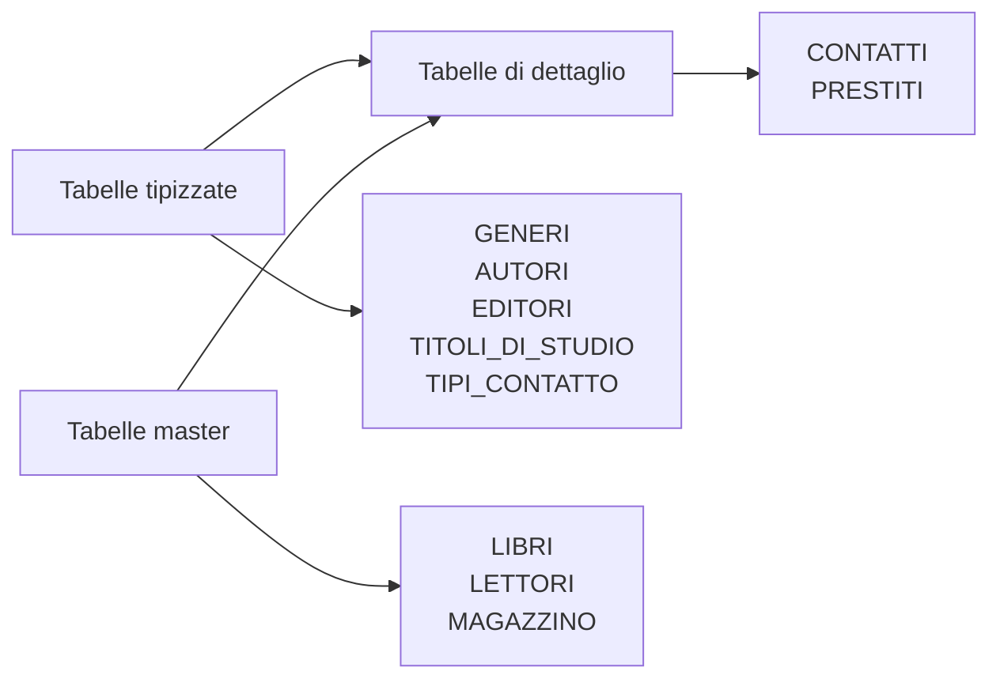
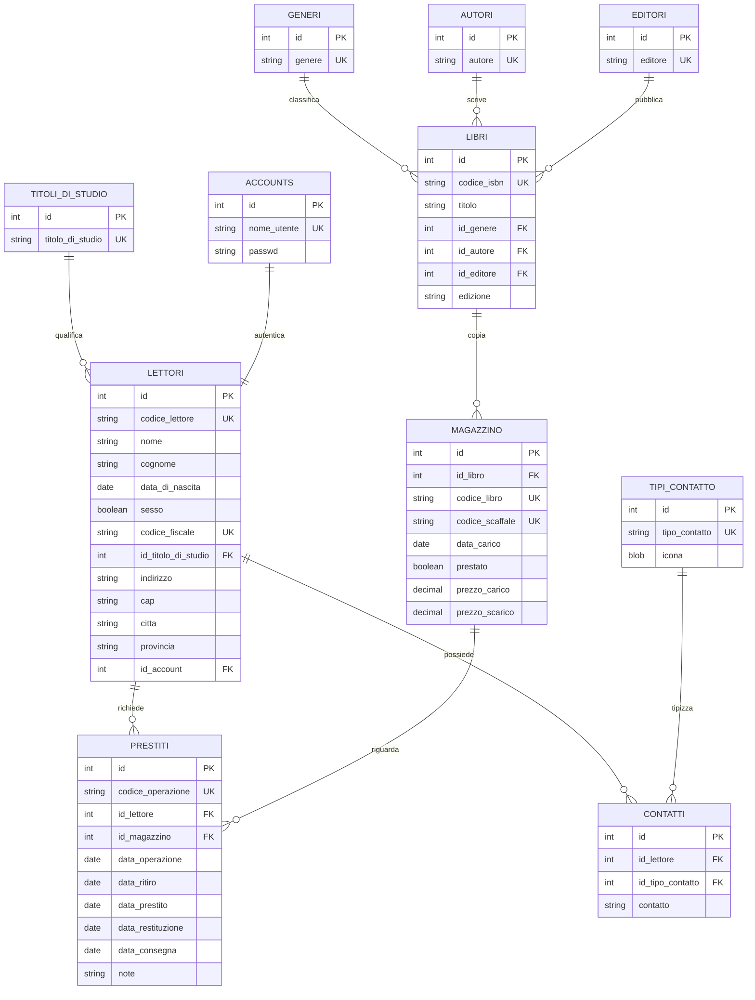
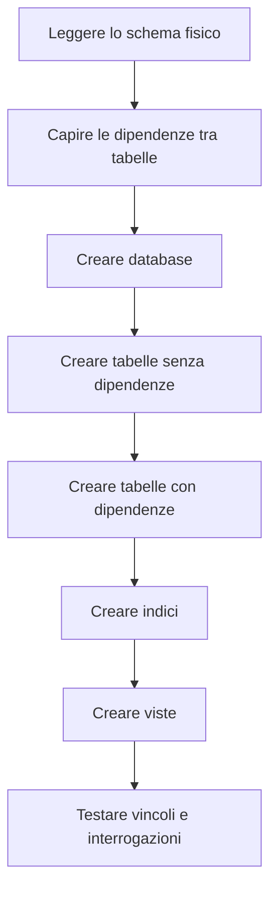

# 15 - Come si implementa un database

## Obiettivi della lezione

Al termine di questa unità il partecipante deve essere in grado di:

- spiegare che cosa significa implementare un database relazionale;
- individuare gli oggetti da creare partendo dallo schema fisico;
- riconoscere l'ordine corretto di creazione di database, tabelle, vincoli, indici e viste;
- creare il database `LIBRI_PRESTATI` in MySQL;
- comprendere perché dopo l'implementazione è necessaria una fase di test.

---

## 1. Che cosa significa implementare un database

Implementare un database significa passare dallo **schema fisico** alla creazione concreta degli oggetti dentro un DBMS.

Nel caso del laboratorio viene usato MySQL. Il database da creare si chiama:

```sql
LIBRI_PRESTATI
```

Lo schema fisico descrive già:

- le tabelle;
- le colonne;
- i tipi di dato;
- le chiavi primarie;
- le chiavi esterne;
- gli indici;
- i vincoli;
- le viste da costruire successivamente.



---

## 2. Dove si colloca l'implementazione

Nel modello a cascata, l'implementazione appartiene alla fase di sviluppo: non si sta più solo progettando il database, ma si stanno creando realmente gli oggetti.



L'attività può essere svolta da figure diverse:

- Database Administrator;
- Developer;
- progettista dati;
- docente o partecipante in un contesto di laboratorio.

Nel mondo reale queste figure possono coincidere nella stessa persona, soprattutto in team piccoli o in contesti di laboratorio.

---

## 3. Ordine consigliato di implementazione

Prima di scrivere codice SQL è necessario leggere lo schema fisico e stabilire l'ordine corretto di creazione degli oggetti.

L'ordine consigliato è:

1. creare il database;
2. creare le tabelle master o tipizzate;
3. creare le tabelle di dettaglio;
4. aggiungere i vincoli di chiave esterna, se non sono già stati definiti nei `CREATE TABLE`;
5. creare gli indici elementari;
6. creare gli indici composti;
7. creare le viste;
8. creare gli utenti;
9. assegnare autorizzazioni e privilegi;
10. testare il database.



---

## 4. Tabelle master, tipizzate e di dettaglio

Nel laboratorio compaiono tre categorie operative di tabelle.

| Tipo tabella | Significato | Esempi |
|---|---|---|
| Tabella tipizzata | Contiene valori di classificazione | `GENERI`, `AUTORI`, `EDITORI`, `TITOLI_DI_STUDIO`, `TIPI_CONTATTO` |
| Tabella master | Contiene un'entità principale | `LETTORI`, `LIBRI`, `MAGAZZINO` |
| Tabella di dettaglio | Contiene dati collegati ad altre tabelle | `CONTATTI`, `PRESTITI` |

Questa distinzione aiuta a scegliere l'ordine di creazione.



---

## 5. Schema generale del database `LIBRI_PRESTATI`



---

## 6. Creazione del database

Per iniziare il laboratorio occorre creare il database.

```sql
CREATE DATABASE IF NOT EXISTS LIBRI_PRESTATI
    DEFAULT CHARACTER SET utf8mb4
    COLLATE utf8mb4_unicode_ci;

USE LIBRI_PRESTATI;
```

### Spiegazione del comando

| Parte del comando | Significato |
|---|---|
| `CREATE DATABASE` | Crea un nuovo database |
| `IF NOT EXISTS` | Evita errore se il database esiste già |
| `DEFAULT CHARACTER SET utf8mb4` | Imposta una codifica moderna per i caratteri |
| `COLLATE utf8mb4_unicode_ci` | Imposta il criterio di confronto testuale |
| `USE LIBRI_PRESTATI` | Seleziona il database su cui lavorare |

---

## 7. Verifica iniziale

Dopo la creazione, è possibile controllare la presenza del database con:

```sql
SHOW DATABASES;
```

Oppure, dopo averlo selezionato:

```sql
SELECT DATABASE();
```

Risultato atteso:

```text
LIBRI_PRESTATI
```

---

## 8. Sintesi operativa



L'implementazione è quindi il momento in cui il modello smette di essere un disegno e diventa un database eseguibile. Da quel momento in poi, gli errori vengono rilevati direttamente dal DBMS durante l'esecuzione dei comandi.
