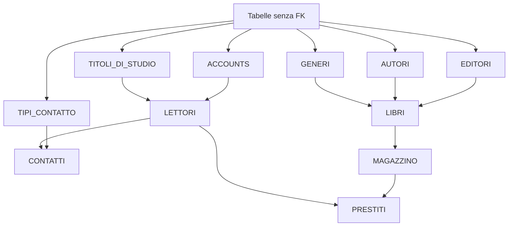
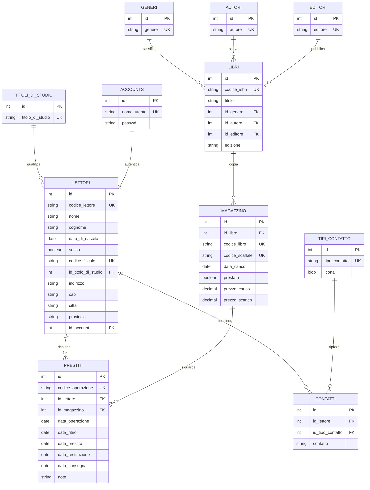
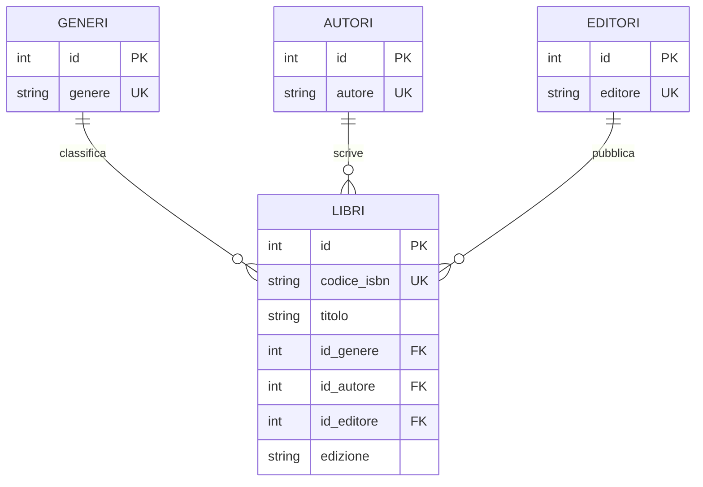
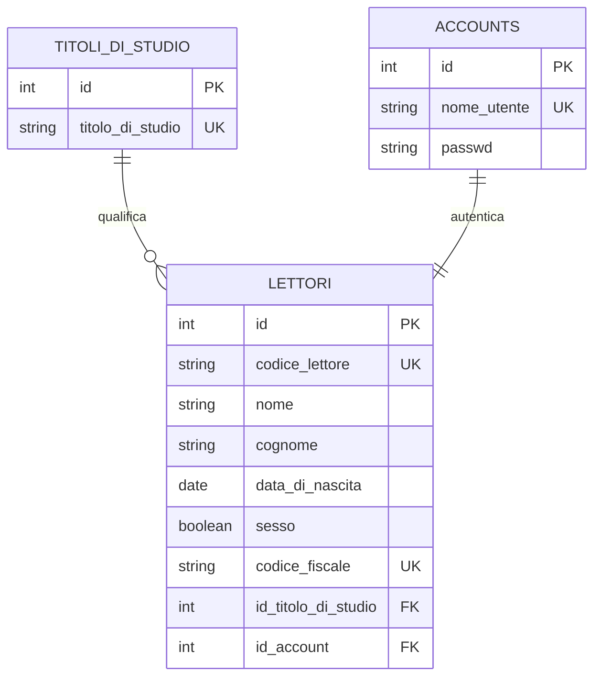
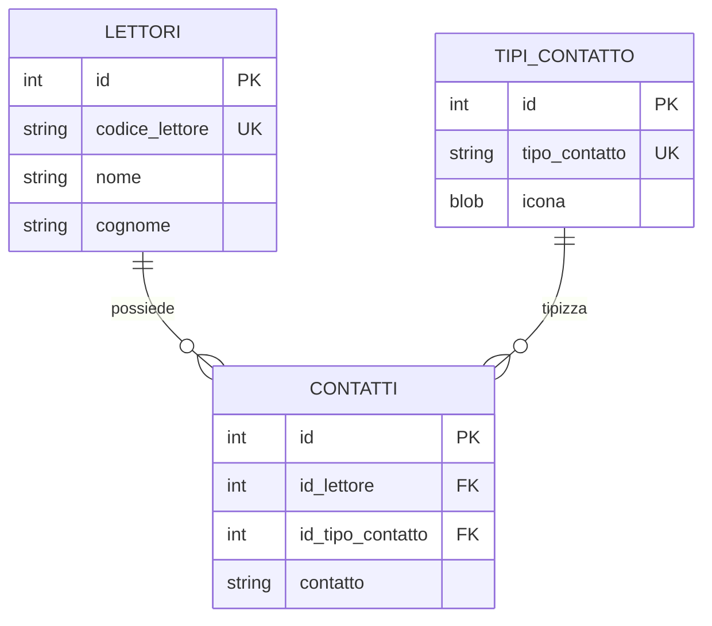
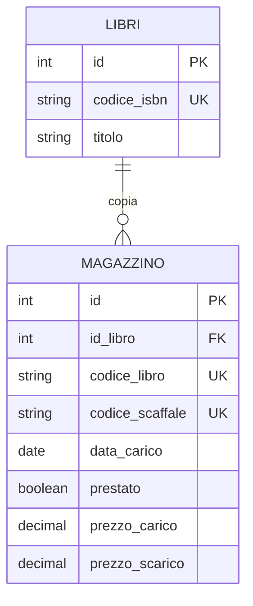
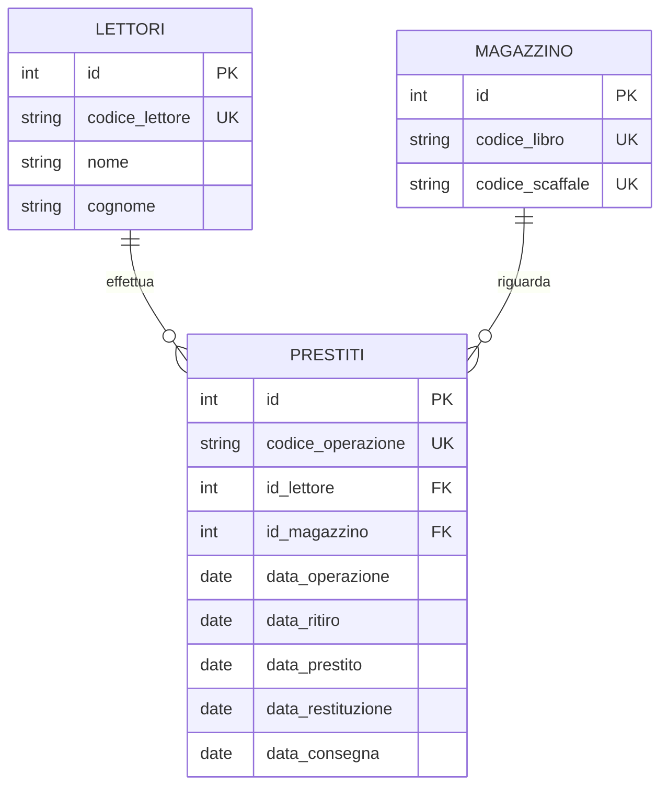
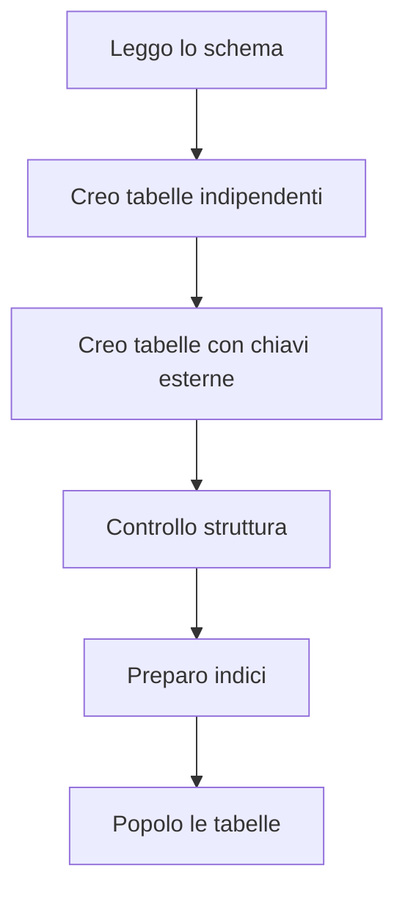

# 16 - Come si creano le tabelle

## Obiettivi della lezione

Al termine di questa unità il partecipante deve essere in grado di:

- distinguere tabelle master, tabelle tipizzate e tabelle di dettaglio;
- creare tabelle con `CREATE TABLE`;
- definire chiavi primarie, chiavi uniche e chiavi esterne;
- usare `ALTER TABLE` quando una chiave esterna non può essere creata subito;
- leggere le relazioni principali del database `LIBRI_PRESTATI`.

---

## 1. Tabelle del database

| Tabelle di dettaglio | Tabelle tipizzate / master |
|---|---|
| `LIBRI` | `GENERI` |
| `LETTORI` | `AUTORI` |
| `CONTATTI` | `EDITORI` |
| `PRESTITI` | `TITOLI_DI_STUDIO` |
| `MAGAZZINO` | `TIPI_CONTATTO` |
|  | `ACCOUNTS` |

In pratica si creano prima le tabelle che non dipendono da altre tabelle. Dopo si creano quelle che contengono chiavi esterne.



---

## 2. Schema generale delle relazioni



---

## 3. Preparazione

```sql
USE LIBRI_PRESTATI;
```

Per rendere effettivi i vincoli di chiave esterna in MySQL è opportuno usare il motore `InnoDB`.

---

## 4. Tabelle tipizzate per i libri

Le tabelle `GENERI`, `AUTORI` ed `EDITORI` sono tabelle di classificazione. Servono a evitare di scrivere più volte gli stessi valori testuali dentro `LIBRI`.

```sql
CREATE TABLE GENERI (
    ID INT PRIMARY KEY AUTO_INCREMENT,
    GENERE VARCHAR(50) UNIQUE NOT NULL
) ENGINE=InnoDB;

CREATE TABLE AUTORI (
    ID INT PRIMARY KEY AUTO_INCREMENT,
    AUTORE VARCHAR(50) UNIQUE NOT NULL
) ENGINE=InnoDB;

CREATE TABLE EDITORI (
    ID INT PRIMARY KEY AUTO_INCREMENT,
    EDITORE VARCHAR(50) UNIQUE NOT NULL
) ENGINE=InnoDB;
```



---

## 5. Tabella `LIBRI`

La tabella `LIBRI` contiene i dati principali del libro e tre chiavi esterne:

- `ID_GENERE` verso `GENERI`;
- `ID_AUTORE` verso `AUTORI`;
- `ID_EDITORE` verso `EDITORI`.

```sql
CREATE TABLE LIBRI (
    ID INT PRIMARY KEY AUTO_INCREMENT,
    CODICE_ISBN CHAR(13) UNIQUE,
    TITOLO VARCHAR(100) NOT NULL,
    ID_GENERE INT NOT NULL,
    ID_AUTORE INT NOT NULL,
    ID_EDITORE INT NOT NULL,
    EDIZIONE CHAR(4),

    CONSTRAINT FK_LIBRI_ID_GENERE
        FOREIGN KEY (ID_GENERE) REFERENCES GENERI(ID),

    CONSTRAINT FK_LIBRI_ID_AUTORE
        FOREIGN KEY (ID_AUTORE) REFERENCES AUTORI(ID),

    CONSTRAINT FK_LIBRI_ID_EDITORE
        FOREIGN KEY (ID_EDITORE) REFERENCES EDITORI(ID)
) ENGINE=InnoDB;
```

### Lettura della tabella

| Colonna | Ruolo |
|---|---|
| `ID` | Chiave primaria tecnica |
| `CODICE_ISBN` | Codice univoco del libro |
| `TITOLO` | Titolo del libro, obbligatorio |
| `ID_GENERE` | Collegamento alla tabella `GENERI` |
| `ID_AUTORE` | Collegamento alla tabella `AUTORI` |
| `ID_EDITORE` | Collegamento alla tabella `EDITORI` |
| `EDIZIONE` | Anno o codice edizione |

---

## 6. Tabelle per i lettori

`LETTORI` dipende da:

- `TITOLI_DI_STUDIO`;
- `ACCOUNTS`.

Nel materiale originale viene mostrato anche l'uso di `ALTER TABLE`: prima si crea una tabella, poi si aggiungono le chiavi esterne. Qui viene proposto uno script più lineare, creando prima le tabelle da cui `LETTORI` dipende.

```sql
CREATE TABLE TITOLI_DI_STUDIO (
    ID INT PRIMARY KEY AUTO_INCREMENT,
    TITOLO_DI_STUDIO VARCHAR(50) UNIQUE NOT NULL
) ENGINE=InnoDB;

CREATE TABLE ACCOUNTS (
    ID INT PRIMARY KEY AUTO_INCREMENT,
    NOME_UTENTE VARCHAR(50) UNIQUE NOT NULL,
    PASSWD CHAR(20) NOT NULL
) ENGINE=InnoDB;
```

```sql
CREATE TABLE LETTORI (
    ID INT PRIMARY KEY AUTO_INCREMENT,
    CODICE_LETTORE CHAR(10) UNIQUE NOT NULL,
    NOME VARCHAR(50) NOT NULL,
    COGNOME VARCHAR(50) NOT NULL,
    DATA_DI_NASCITA DATE,
    SESSO BOOLEAN NOT NULL,
    CODICE_FISCALE CHAR(16) UNIQUE NOT NULL,
    ID_TITOLO_DI_STUDIO INT,
    INDIRIZZO VARCHAR(100),
    CAP CHAR(5),
    CITTA VARCHAR(50),
    PROVINCIA CHAR(2),
    ID_ACCOUNT INT UNIQUE NOT NULL,

    CONSTRAINT FK_LETTORI_ID_TITOLO_DI_STUDIO
        FOREIGN KEY (ID_TITOLO_DI_STUDIO) REFERENCES TITOLI_DI_STUDIO(ID),

    CONSTRAINT FK_LETTORI_ID_ACCOUNT
        FOREIGN KEY (ID_ACCOUNT) REFERENCES ACCOUNTS(ID)
) ENGINE=InnoDB;
```



---

## 7. Alternativa con `ALTER TABLE`

Se si crea `LETTORI` prima delle tabelle `TITOLI_DI_STUDIO` e `ACCOUNTS`, le chiavi esterne non possono essere definite subito.

In quel caso si procede così:

```sql
ALTER TABLE LETTORI
ADD CONSTRAINT FK_LETTORI_ID_TITOLO_DI_STUDIO
FOREIGN KEY (ID_TITOLO_DI_STUDIO) REFERENCES TITOLI_DI_STUDIO(ID);

ALTER TABLE LETTORI
ADD CONSTRAINT FK_LETTORI_ID_ACCOUNT
FOREIGN KEY (ID_ACCOUNT) REFERENCES ACCOUNTS(ID);
```

Il principio è semplice: una chiave esterna può riferirsi solo a una tabella che esiste già.

---

## 8. Tabelle `TIPI_CONTATTO` e `CONTATTI`

`CONTATTI` è una tabella di dettaglio collegata a:

- `LETTORI`;
- `TIPI_CONTATTO`.

```sql
CREATE TABLE TIPI_CONTATTO (
    ID INT PRIMARY KEY AUTO_INCREMENT,
    TIPO_CONTATTO VARCHAR(50) UNIQUE NOT NULL,
    ICONA BLOB
) ENGINE=InnoDB;
```

```sql
CREATE TABLE CONTATTI (
    ID INT PRIMARY KEY AUTO_INCREMENT,
    ID_LETTORE INT NOT NULL,
    ID_TIPO_CONTATTO INT NOT NULL,
    CONTATTO VARCHAR(50) NOT NULL,

    CONSTRAINT FK_CONTATTI_ID_LETTORE
        FOREIGN KEY (ID_LETTORE) REFERENCES LETTORI(ID),

    CONSTRAINT FK_CONTATTI_ID_TIPO_CONTATTO
        FOREIGN KEY (ID_TIPO_CONTATTO) REFERENCES TIPI_CONTATTO(ID)
) ENGINE=InnoDB;
```



---

## 9. Tabella `MAGAZZINO`

La tabella `MAGAZZINO` rappresenta le copie fisiche dei libri. Un libro può avere più copie in magazzino.

```sql
CREATE TABLE MAGAZZINO (
    ID INT PRIMARY KEY AUTO_INCREMENT,
    ID_LIBRO INT NOT NULL,
    CODICE_LIBRO CHAR(10) UNIQUE NOT NULL,
    CODICE_SCAFFALE VARCHAR(10) UNIQUE NOT NULL,
    DATA_CARICO DATE NOT NULL,
    PRESTATO BOOLEAN DEFAULT FALSE,
    PREZZO_CARICO DECIMAL(6,2) CHECK (PREZZO_CARICO >= 0),
    PREZZO_SCARICO DECIMAL(6,2) CHECK (PREZZO_SCARICO >= 0),

    CONSTRAINT FK_MAGAZZINO_ID_LIBRO
        FOREIGN KEY (ID_LIBRO) REFERENCES LIBRI(ID)
) ENGINE=InnoDB;
```



### Nota sul vincolo `CHECK`

Il materiale originale segnala che MySQL non gestiva i vincoli `CHECK`. Questa affermazione era vera per versioni vecchie. Nelle versioni moderne di MySQL il vincolo `CHECK` viene gestito. In un laboratorio aggiornato conviene quindi mantenerlo e testarlo.

---

## 10. Tabella `PRESTITI`

`PRESTITI` registra le operazioni di prenotazione, prestito e restituzione.

È una tabella di dettaglio collegata a:

- `LETTORI`;
- `MAGAZZINO`.

```sql
CREATE TABLE PRESTITI (
    ID INT PRIMARY KEY AUTO_INCREMENT,
    CODICE_OPERAZIONE CHAR(10) NOT NULL,
    ID_LETTORE INT NOT NULL,
    ID_MAGAZZINO INT NOT NULL,
    DATA_OPERAZIONE DATE NOT NULL,
    DATA_RITIRO DATE NOT NULL,
    DATA_PRESTITO DATE,
    DATA_RESTITUZIONE DATE,
    DATA_CONSEGNA DATE,
    NOTE VARCHAR(500),

    CONSTRAINT FK_PRESTITI_ID_LETTORE
        FOREIGN KEY (ID_LETTORE) REFERENCES LETTORI(ID),

    CONSTRAINT FK_PRESTITI_ID_MAGAZZINO
        FOREIGN KEY (ID_MAGAZZINO) REFERENCES MAGAZZINO(ID)
) ENGINE=InnoDB;
```



---

## 11. Script completo ordinato

```sql
USE LIBRI_PRESTATI;

CREATE TABLE GENERI (
    ID INT PRIMARY KEY AUTO_INCREMENT,
    GENERE VARCHAR(50) UNIQUE NOT NULL
) ENGINE=InnoDB;

CREATE TABLE AUTORI (
    ID INT PRIMARY KEY AUTO_INCREMENT,
    AUTORE VARCHAR(50) UNIQUE NOT NULL
) ENGINE=InnoDB;

CREATE TABLE EDITORI (
    ID INT PRIMARY KEY AUTO_INCREMENT,
    EDITORE VARCHAR(50) UNIQUE NOT NULL
) ENGINE=InnoDB;

CREATE TABLE TITOLI_DI_STUDIO (
    ID INT PRIMARY KEY AUTO_INCREMENT,
    TITOLO_DI_STUDIO VARCHAR(50) UNIQUE NOT NULL
) ENGINE=InnoDB;

CREATE TABLE ACCOUNTS (
    ID INT PRIMARY KEY AUTO_INCREMENT,
    NOME_UTENTE VARCHAR(50) UNIQUE NOT NULL,
    PASSWD CHAR(20) NOT NULL
) ENGINE=InnoDB;

CREATE TABLE TIPI_CONTATTO (
    ID INT PRIMARY KEY AUTO_INCREMENT,
    TIPO_CONTATTO VARCHAR(50) UNIQUE NOT NULL,
    ICONA BLOB
) ENGINE=InnoDB;

CREATE TABLE LIBRI (
    ID INT PRIMARY KEY AUTO_INCREMENT,
    CODICE_ISBN CHAR(13) UNIQUE,
    TITOLO VARCHAR(100) NOT NULL,
    ID_GENERE INT NOT NULL,
    ID_AUTORE INT NOT NULL,
    ID_EDITORE INT NOT NULL,
    EDIZIONE CHAR(4),
    CONSTRAINT FK_LIBRI_ID_GENERE FOREIGN KEY (ID_GENERE) REFERENCES GENERI(ID),
    CONSTRAINT FK_LIBRI_ID_AUTORE FOREIGN KEY (ID_AUTORE) REFERENCES AUTORI(ID),
    CONSTRAINT FK_LIBRI_ID_EDITORE FOREIGN KEY (ID_EDITORE) REFERENCES EDITORI(ID)
) ENGINE=InnoDB;

CREATE TABLE LETTORI (
    ID INT PRIMARY KEY AUTO_INCREMENT,
    CODICE_LETTORE CHAR(10) UNIQUE NOT NULL,
    NOME VARCHAR(50) NOT NULL,
    COGNOME VARCHAR(50) NOT NULL,
    DATA_DI_NASCITA DATE,
    SESSO BOOLEAN NOT NULL,
    CODICE_FISCALE CHAR(16) UNIQUE NOT NULL,
    ID_TITOLO_DI_STUDIO INT,
    INDIRIZZO VARCHAR(100),
    CAP CHAR(5),
    CITTA VARCHAR(50),
    PROVINCIA CHAR(2),
    ID_ACCOUNT INT UNIQUE NOT NULL,
    CONSTRAINT FK_LETTORI_ID_TITOLO_DI_STUDIO FOREIGN KEY (ID_TITOLO_DI_STUDIO) REFERENCES TITOLI_DI_STUDIO(ID),
    CONSTRAINT FK_LETTORI_ID_ACCOUNT FOREIGN KEY (ID_ACCOUNT) REFERENCES ACCOUNTS(ID)
) ENGINE=InnoDB;

CREATE TABLE CONTATTI (
    ID INT PRIMARY KEY AUTO_INCREMENT,
    ID_LETTORE INT NOT NULL,
    ID_TIPO_CONTATTO INT NOT NULL,
    CONTATTO VARCHAR(50) NOT NULL,
    CONSTRAINT FK_CONTATTI_ID_LETTORE FOREIGN KEY (ID_LETTORE) REFERENCES LETTORI(ID),
    CONSTRAINT FK_CONTATTI_ID_TIPO_CONTATTO FOREIGN KEY (ID_TIPO_CONTATTO) REFERENCES TIPI_CONTATTO(ID)
) ENGINE=InnoDB;

CREATE TABLE MAGAZZINO (
    ID INT PRIMARY KEY AUTO_INCREMENT,
    ID_LIBRO INT NOT NULL,
    CODICE_LIBRO CHAR(10) UNIQUE NOT NULL,
    CODICE_SCAFFALE VARCHAR(10) UNIQUE NOT NULL,
    DATA_CARICO DATE NOT NULL,
    PRESTATO BOOLEAN DEFAULT FALSE,
    PREZZO_CARICO DECIMAL(6,2) CHECK (PREZZO_CARICO >= 0),
    PREZZO_SCARICO DECIMAL(6,2) CHECK (PREZZO_SCARICO >= 0),
    CONSTRAINT FK_MAGAZZINO_ID_LIBRO FOREIGN KEY (ID_LIBRO) REFERENCES LIBRI(ID)
) ENGINE=InnoDB;

CREATE TABLE PRESTITI (
    ID INT PRIMARY KEY AUTO_INCREMENT,
    CODICE_OPERAZIONE CHAR(10) NOT NULL,
    ID_LETTORE INT NOT NULL,
    ID_MAGAZZINO INT NOT NULL,
    DATA_OPERAZIONE DATE NOT NULL,
    DATA_RITIRO DATE NOT NULL,
    DATA_PRESTITO DATE,
    DATA_RESTITUZIONE DATE,
    DATA_CONSEGNA DATE,
    NOTE VARCHAR(500),
    CONSTRAINT FK_PRESTITI_ID_LETTORE FOREIGN KEY (ID_LETTORE) REFERENCES LETTORI(ID),
    CONSTRAINT FK_PRESTITI_ID_MAGAZZINO FOREIGN KEY (ID_MAGAZZINO) REFERENCES MAGAZZINO(ID)
) ENGINE=InnoDB;
```

---

## 12. Verifica delle tabelle create

```sql
SHOW TABLES;
```

```sql
DESCRIBE LIBRI;
DESCRIBE LETTORI;
DESCRIBE CONTATTI;
DESCRIBE MAGAZZINO;
DESCRIBE PRESTITI;
```

---

## 13. Sintesi finale



L'ordine di creazione non è un dettaglio secondario: se una tabella contiene una chiave esterna verso un'altra tabella, la tabella di destinazione deve esistere prima.
