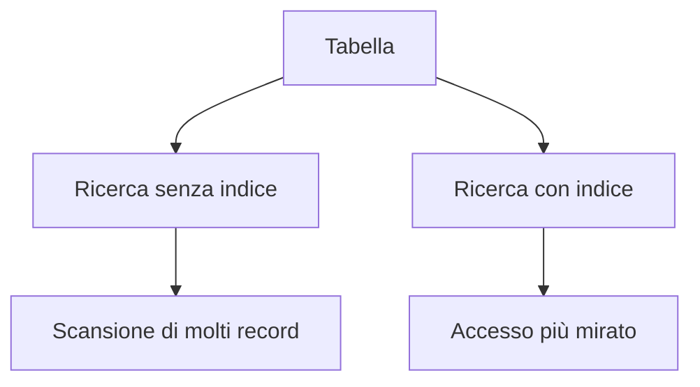
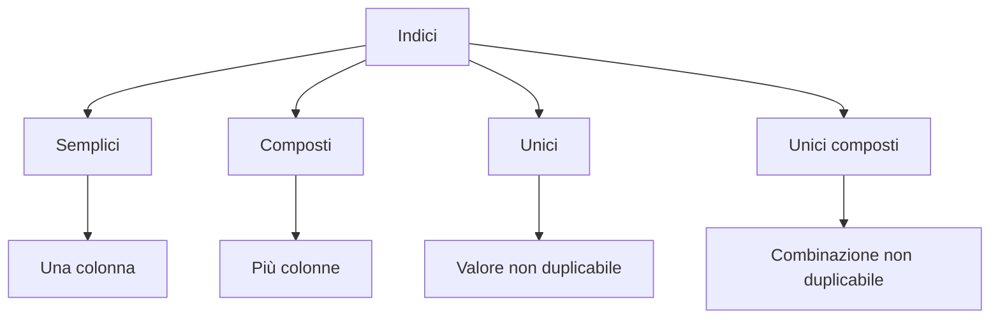
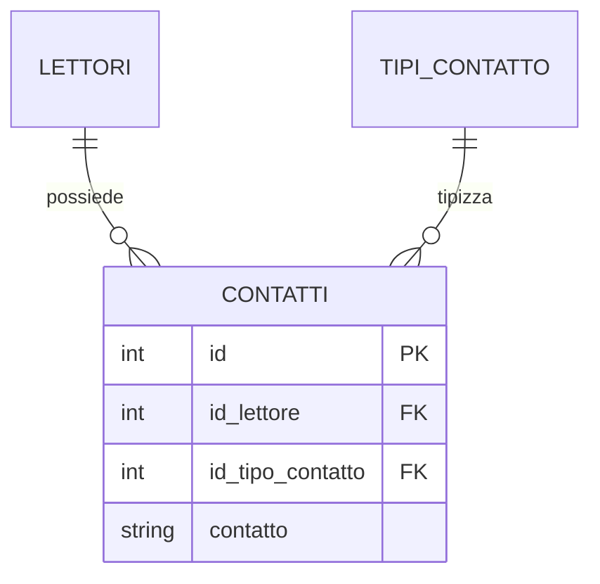
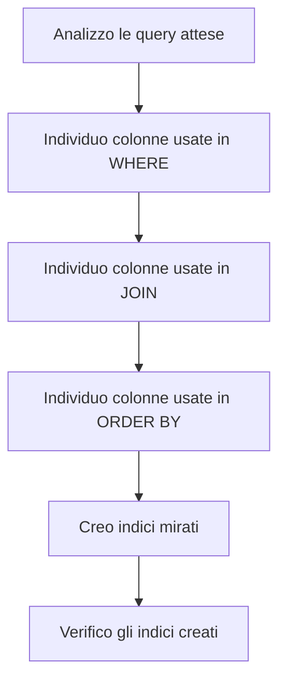

# 17 - Come si creano gli indici

## Obiettivi della lezione

Al termine di questa unità il partecipante deve essere in grado di:

- distinguere indici semplici, composti e unici;
- capire quando un indice viene creato automaticamente;
- creare indici con `CREATE INDEX`;
- creare indici unici composti con `CREATE UNIQUE INDEX`;
- verificare gli indici presenti in una tabella.

---

## 1. A cosa servono gli indici

Un indice è una struttura usata dal DBMS per velocizzare ricerche, ordinamenti e join.

Gli indici però non sono magia gratuita:

- migliorano le letture;
- possono rallentare inserimenti, modifiche e cancellazioni;
- occupano spazio;
- vanno creati sulle colonne realmente utili.



---

## 2. Tipi di indice

| Tipo indice | Descrizione | Esempio |
|---|---|---|
| Indice semplice | Basato su una sola colonna | `IX_LIBRI_TITOLO` |
| Indice composto | Basato su più colonne | `IX_LETTORI_CITTA_COGNOME_NOME` |
| Indice unico | Non accetta valori duplicati | `UX_LIBRI_CODICE_ISBN` |
| Indice unico composto | Non accetta duplicati sulla combinazione di più colonne | `UX_CONTATTI_ID_LETTORE_ID_TIPO_CONTATTO_CONTATTO` |



---

## 3. Indici unici creati automaticamente

Quando una colonna viene dichiarata `UNIQUE`, MySQL crea automaticamente un indice unico.

Esempio:

```sql
CREATE TABLE TIPI_CONTATTO (
    ID INT PRIMARY KEY AUTO_INCREMENT,
    TIPO_CONTATTO VARCHAR(50) UNIQUE NOT NULL,
    ICONA BLOB
) ENGINE=InnoDB;
```

In questo caso `TIPO_CONTATTO` non può contenere duplicati.

---

## 4. Indice unico composto sulla tabella `CONTATTI`

La tabella `CONTATTI` deve impedire che lo stesso lettore abbia due volte lo stesso contatto dello stesso tipo.

Esempio di situazione da impedire:

| ID_LETTORE | ID_TIPO_CONTATTO | CONTATTO |
|---:|---:|---|
| 8 | 4 | `3124789360` |
| 8 | 4 | `3124789360` |

Il vincolo corretto non riguarda una sola colonna, ma la combinazione delle tre colonne.



```sql
CREATE UNIQUE INDEX UX_CONTATTI_ID_LETTORE_ID_TIPO_CONTATTO_CONTATTO
ON CONTATTI (ID_LETTORE, ID_TIPO_CONTATTO, CONTATTO);
```

---

## 5. Indice unico sul codice operazione dei prestiti

Ogni operazione di prestito deve avere un codice non duplicato.

```sql
CREATE UNIQUE INDEX UX_PRESTITI_CODICE_OPERAZIONE
ON PRESTITI (CODICE_OPERAZIONE);
```

---

## 6. Indici sui libri

```sql
CREATE INDEX IX_LIBRI_TITOLO
ON LIBRI (TITOLO);

CREATE INDEX IX_LIBRI_ID_GENERE
ON LIBRI (ID_GENERE);

CREATE INDEX IX_LIBRI_ID_AUTORE
ON LIBRI (ID_AUTORE);

CREATE INDEX IX_LIBRI_ID_EDITORE
ON LIBRI (ID_EDITORE);
```

Questi indici sono utili perché i libri vengono spesso cercati per titolo, genere, autore o editore.

---

## 7. Indici sul magazzino

Nel materiale originale alcuni comandi risultano associati alla tabella sbagliata. Gli indici sui campi di magazzino devono essere creati su `MAGAZZINO`, non su `LIBRI`.

```sql
CREATE INDEX IX_MAGAZZINO_ID_LIBRO
ON MAGAZZINO (ID_LIBRO);

CREATE INDEX IX_MAGAZZINO_DATA_CARICO
ON MAGAZZINO (DATA_CARICO);

CREATE INDEX IX_MAGAZZINO_PRESTATO
ON MAGAZZINO (PRESTATO);
```

---

## 8. Indici sui prestiti

```sql
CREATE INDEX IX_PRESTITI_DATA_OPERAZIONE
ON PRESTITI (DATA_OPERAZIONE);

CREATE INDEX IX_PRESTITI_DATA_RITIRO
ON PRESTITI (DATA_RITIRO);

CREATE INDEX IX_PRESTITI_DATA_PRESTITO
ON PRESTITI (DATA_PRESTITO);

CREATE INDEX IX_PRESTITI_DATA_RESTITUZIONE
ON PRESTITI (DATA_RESTITUZIONE);

CREATE INDEX IX_PRESTITI_DATA_CONSEGNA
ON PRESTITI (DATA_CONSEGNA);

CREATE INDEX IX_PRESTITI_ID_MAGAZZINO
ON PRESTITI (ID_MAGAZZINO);

CREATE INDEX IX_PRESTITI_ID_LETTORE
ON PRESTITI (ID_LETTORE);
```

---

## 9. Indici sui lettori

```sql
CREATE INDEX IX_LETTORI_NOME
ON LETTORI (NOME);

CREATE INDEX IX_LETTORI_COGNOME
ON LETTORI (COGNOME);

CREATE INDEX IX_LETTORI_DATA_DI_NASCITA
ON LETTORI (DATA_DI_NASCITA);

CREATE INDEX IX_LETTORI_ID_TITOLO_DI_STUDIO
ON LETTORI (ID_TITOLO_DI_STUDIO);

CREATE INDEX IX_LETTORI_SESSO
ON LETTORI (SESSO);

CREATE INDEX IX_LETTORI_CITTA
ON LETTORI (CITTA);

CREATE INDEX IX_LETTORI_CITTA_COGNOME_NOME
ON LETTORI (CITTA, COGNOME, NOME);
```

L'indice composto `IX_LETTORI_CITTA_COGNOME_NOME` è utile quando si ordinano o filtrano i lettori per città, cognome e nome.


---

## 10. Indici su contatti e account

```sql
CREATE INDEX IX_CONTATTI_ID_LETTORE
ON CONTATTI (ID_LETTORE);

CREATE INDEX IX_CONTATTI_CONTATTO
ON CONTATTI (CONTATTO);

CREATE INDEX IX_CONTATTI_ID_TIPO_CONTATTO
ON CONTATTI (ID_TIPO_CONTATTO);

CREATE INDEX IX_ACCOUNTS_PASSWD
ON ACCOUNTS (PASSWD);
```

Nota didattica: nella pratica reale è discutibile indicizzare o conservare password in chiaro. In un'applicazione reale le password vanno gestite con hash sicuri e non come semplice testo. Qui il campo è usato solo per coerenza con lo schema del laboratorio.

---

## 11. Script riepilogativo

```sql
USE LIBRI_PRESTATI;

CREATE UNIQUE INDEX UX_CONTATTI_ID_LETTORE_ID_TIPO_CONTATTO_CONTATTO
ON CONTATTI (ID_LETTORE, ID_TIPO_CONTATTO, CONTATTO);

CREATE UNIQUE INDEX UX_PRESTITI_CODICE_OPERAZIONE
ON PRESTITI (CODICE_OPERAZIONE);

CREATE INDEX IX_LIBRI_TITOLO ON LIBRI (TITOLO);
CREATE INDEX IX_LIBRI_ID_GENERE ON LIBRI (ID_GENERE);
CREATE INDEX IX_LIBRI_ID_AUTORE ON LIBRI (ID_AUTORE);
CREATE INDEX IX_LIBRI_ID_EDITORE ON LIBRI (ID_EDITORE);

CREATE INDEX IX_MAGAZZINO_ID_LIBRO ON MAGAZZINO (ID_LIBRO);
CREATE INDEX IX_MAGAZZINO_DATA_CARICO ON MAGAZZINO (DATA_CARICO);
CREATE INDEX IX_MAGAZZINO_PRESTATO ON MAGAZZINO (PRESTATO);

CREATE INDEX IX_PRESTITI_DATA_OPERAZIONE ON PRESTITI (DATA_OPERAZIONE);
CREATE INDEX IX_PRESTITI_DATA_RITIRO ON PRESTITI (DATA_RITIRO);
CREATE INDEX IX_PRESTITI_DATA_PRESTITO ON PRESTITI (DATA_PRESTITO);
CREATE INDEX IX_PRESTITI_DATA_RESTITUZIONE ON PRESTITI (DATA_RESTITUZIONE);
CREATE INDEX IX_PRESTITI_DATA_CONSEGNA ON PRESTITI (DATA_CONSEGNA);
CREATE INDEX IX_PRESTITI_ID_MAGAZZINO ON PRESTITI (ID_MAGAZZINO);
CREATE INDEX IX_PRESTITI_ID_LETTORE ON PRESTITI (ID_LETTORE);

CREATE INDEX IX_LETTORI_NOME ON LETTORI (NOME);
CREATE INDEX IX_LETTORI_COGNOME ON LETTORI (COGNOME);
CREATE INDEX IX_LETTORI_DATA_DI_NASCITA ON LETTORI (DATA_DI_NASCITA);
CREATE INDEX IX_LETTORI_ID_TITOLO_DI_STUDIO ON LETTORI (ID_TITOLO_DI_STUDIO);
CREATE INDEX IX_LETTORI_SESSO ON LETTORI (SESSO);
CREATE INDEX IX_LETTORI_CITTA ON LETTORI (CITTA);
CREATE INDEX IX_LETTORI_CITTA_COGNOME_NOME ON LETTORI (CITTA, COGNOME, NOME);

CREATE INDEX IX_CONTATTI_ID_LETTORE ON CONTATTI (ID_LETTORE);
CREATE INDEX IX_CONTATTI_CONTATTO ON CONTATTI (CONTATTO);
CREATE INDEX IX_CONTATTI_ID_TIPO_CONTATTO ON CONTATTI (ID_TIPO_CONTATTO);
CREATE INDEX IX_ACCOUNTS_PASSWD ON ACCOUNTS (PASSWD);
```

---

## 12. Verifica degli indici

```sql
SHOW INDEX FROM LIBRI;
SHOW INDEX FROM LETTORI;
SHOW INDEX FROM CONTATTI;
SHOW INDEX FROM MAGAZZINO;
SHOW INDEX FROM PRESTITI;
```

---

## 13. Sintesi finale



Gli indici vanno progettati in base alle query previste. Troppi indici possono creare overhead; pochi indici possono rendere lente le query.
