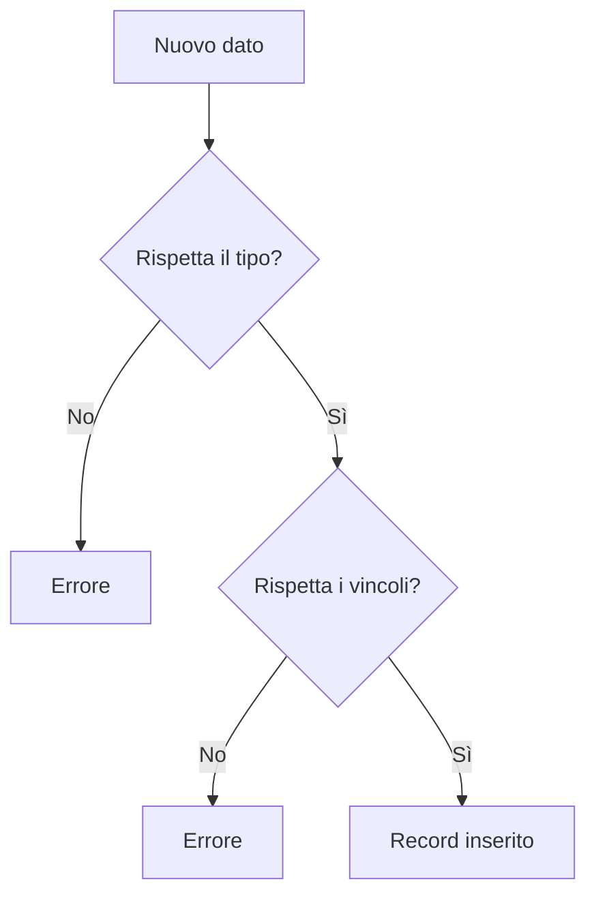
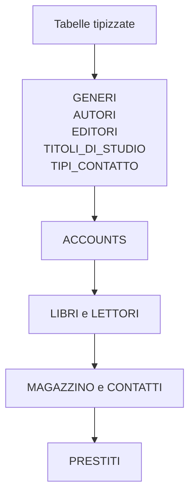
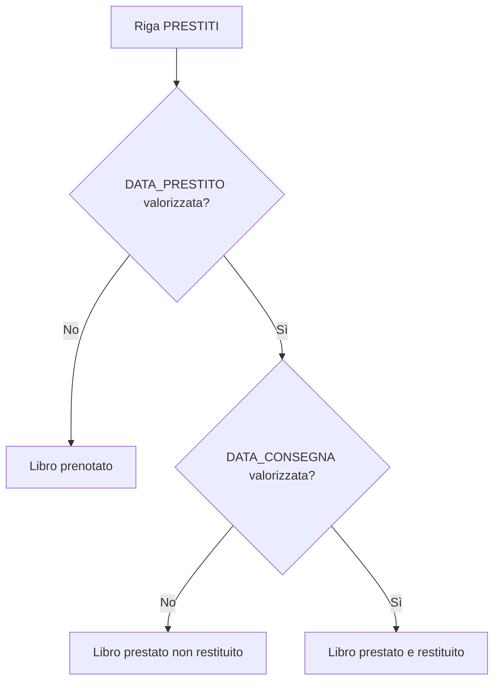
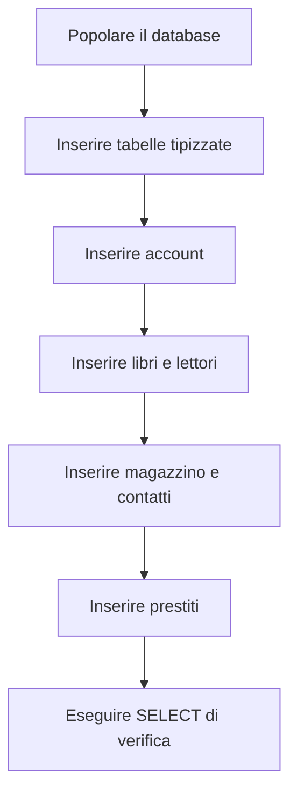

# 18 - Come si popola un database

## Obiettivi della lezione

Al termine di questa unità il partecipante deve essere in grado di:

- spiegare cosa significa popolare un database;
- usare il comando `INSERT INTO`;
- rispettare tipi di dato e vincoli;
- inserire i dati nell'ordine corretto;
- distinguere dati di classificazione, dati master e dati di dettaglio.

---

## 1. Che cosa significa popolare un database

Popolare un database significa inserire dati nelle tabelle.

Per inserire dati si usa il comando:

```sql
INSERT INTO nome_tabella (colonna1, colonna2)
VALUES (valore1, valore2);
```

Prima di inserire dati bisogna rispettare:

- tipi di dato;
- vincoli `NOT NULL`;
- vincoli `UNIQUE`;
- vincoli `FOREIGN KEY`;
- vincoli `CHECK`;
- formato delle date.

---

## 2. Regole pratiche sui valori

| Tipo valore | Regola | Esempio |
|---|---|---|
| `VARCHAR` / `CHAR` | Va scritto tra apici singoli | `'Stephen King'` |
| Apostrofo nel testo | Si raddoppia l'apice | `'D''Amico'` |
| Numero decimale | Si usa il punto, non la virgola | `15.70` |
| Booleano | Si usa `TRUE` / `FALSE` oppure `1` / `0` | `TRUE` |
| Data | Formato consigliato `YYYY-MM-DD` | `'1998-05-20'` |
| Valore assente | Si usa `NULL` se la colonna lo consente | `NULL` |



---

## 3. Ordine corretto di popolamento

Per evitare errori di integrità referenziale, si popolano prima le tabelle che non dipendono da altre tabelle.



---

## 4. Inserimento generi ed editori

```sql
USE LIBRI_PRESTATI;

INSERT INTO GENERI (GENERE) VALUES
('Giallo'),
('Fantasy'),
('Biografia'),
('Romanzo'),
('Noir'),
('Informatica');

INSERT INTO EDITORI (EDITORE) VALUES
('Einaudi'),
('Adelphi Edizioni'),
('Gaskell'),
('Hoepli'),
('Garzanti');
```

Verifica:

```sql
SELECT * FROM GENERI;
SELECT * FROM EDITORI;
```

---

## 5. Inserimento autori

```sql
INSERT INTO AUTORI (AUTORE) VALUES
('Stephen King'),
('Stieg Larsson'),
('Michael Ende'),
('Christopher Paolini'),
('Nelson Mandela'),
('Brandon Sanderson'),
('Paul Auster'),
('Alan Bennett'),
('Elizabeth'),
('Raymond Chandler'),
('James Ellroy'),
('Bjarne Stroustrup');
```

Verifica:

```sql
SELECT * FROM AUTORI;
```

---

## 6. Inserimento libri

I libri possono essere inseriti solo se esistono già i generi, gli autori e gli editori collegati.

```sql
INSERT INTO LIBRI (TITOLO, CODICE_ISBN, ID_GENERE, ID_AUTORE, ID_EDITORE, EDIZIONE) VALUES
('Fine turno', '0001245274123', 1, 1, 3, '1998'),
('Uomini che odiano le donne', '0124305853912', 1, 2, 4, '1999'),
('Mr. Mercedes', '0124357391752', 1, 1, 3, '2000'),
('La storia infinita', '7491123484211', 2, 3, 2, '2000'),
('Eragon', '7491342723942', 2, 4, 3, '1998'),
('La via dei re', '7549263284853', 2, 6, 3, '1998'),
('Lungo cammino verso la libertà', '9324568435764', 3, 5, 3, '2000'),
('Diario inverno', '7324764643664', 5, 8, 4, '1999'),
('Una vita come le altre', '3243582558233', 3, 8, 2, '1999'),
('C++ 4th edition', '9324568435766', 6, 12, 5, '2010'),
('Uno splendido disastro', '1324568435764', 1, 9, 5, '2015'),
('A nudo per te', '9324568437564', 2, 10, 5, '2010'),
('Addio, mia amata', '9324564835765', 3, 11, 3, '2015'),
('Dalia Nera', '9324568412364', 4, 6, 3, '2000'),
('Il grande nulla', '9321238435764', 5, 5, 3, '2010');
```

Verifica:

```sql
SELECT * FROM LIBRI;
```

---

## 7. Inserimento magazzino

Ogni riga di `MAGAZZINO` rappresenta una copia fisica di un libro.

```sql
INSERT INTO MAGAZZINO
(ID_LIBRO, CODICE_LIBRO, CODICE_SCAFFALE, DATA_CARICO, PRESTATO, PREZZO_CARICO, PREZZO_SCARICO) VALUES
(1, '1112223331', '000001', '2016-11-09', FALSE, 1.00, 3.00),
(2, '1112223332', '000002', '2016-11-09', FALSE, 1.00, 3.00),
(3, '1112223333', '000003', '2016-11-09', FALSE, 0.00, 2.00),
(4, '1112223334', '000004', '2016-11-09', FALSE, 1.00, 4.00),
(5, '1112223335', '100001', '2016-11-09', FALSE, 1.00, 3.00),
(6, '1112223336', '100002', '2016-11-09', FALSE, 1.00, 3.00),
(7, '1112223337', '100003', '2016-11-09', FALSE, 0.00, 2.00),
(8, '1112223338', '100004', '2016-11-09', FALSE, 1.00, 5.00),
(9, '1112223339', '100005', '2016-11-09', FALSE, 1.00, 3.00),
(10, '1112223340', '100006', '2016-11-09', FALSE, 3.00, 6.00),
(11, '1112223341', '103003', '2016-11-09', FALSE, 0.00, 2.00),
(12, '1112223342', '103004', '2016-11-09', FALSE, 5.00, 10.00),
(13, '1112223343', '104001', '2016-11-09', FALSE, 1.00, 3.00),
(14, '1112223344', '100432', '2016-11-09', FALSE, 1.00, 4.00),
(13, '1112223345', '100303', '2016-11-09', FALSE, 1.00, 3.00),
(14, '1112223346', '100234', '2016-11-09', FALSE, 1.00, 4.00);
```

Verifica:

```sql
SELECT * FROM MAGAZZINO;
```

---

## 8. Inserimento titoli di studio e tipi di contatto

```sql
INSERT INTO TITOLI_DI_STUDIO (TITOLO_DI_STUDIO) VALUES
('licenza media'),
('diploma'),
('laurea triennale'),
('laurea');

INSERT INTO TIPI_CONTATTO (TIPO_CONTATTO) VALUES
('Google plus'),
('Skype'),
('Email'),
('Telefono'),
('Facebook'),
('Linkedin'),
('Skillbook'),
('Cellulare');
```

Verifica:

```sql
SELECT * FROM TITOLI_DI_STUDIO;
SELECT * FROM TIPI_CONTATTO;
```

---

## 9. Inserimento account

```sql
INSERT INTO ACCOUNTS (NOME_UTENTE, PASSWD) VALUES
('mentos96', 'pw123'),
('ash97', 'pw1234'),
('marco36', 'pw1235'),
('michela12', 'pw1238'),
('dezio68000', 'pw123k'),
('carmy7', 'pw123h'),
('mirco91', 'pw123w'),
('chri91', 'pw123g5'),
('sa2n90', 'pw123qz'),
('benny71', 'pw12356j'),
('paolino89', 'pw123e'),
('albertina200', 'pw123v'),
('osergio', 'pv123c12'),
('sandrina12', 'pw123ed'),
('paoletto2345', 'pw1234f'),
('chri', 'pw123b');
```

---

## 10. Inserimento lettori

```sql
INSERT INTO LETTORI
(CODICE_LETTORE, NOME, COGNOME, DATA_DI_NASCITA, SESSO, CODICE_FISCALE,
 ID_TITOLO_DI_STUDIO, INDIRIZZO, CAP, CITTA, PROVINCIA, ID_ACCOUNT) VALUES
('A1', 'Antonio', 'Mautone', '1998-10-20', TRUE, 'MTNNTN98L10F850T', 1, 'Via Vomero', '80100', 'Napoli', 'NA', 1),
('A2', 'Simona', 'Belladonna', '1999-02-23', FALSE, 'SMNBLL99L24F870T', 2, 'Via V.Emanuele', '80100', 'Napoli', 'NA', 2),
('A3', 'Marco', 'Auriemma', '1996-03-22', TRUE, 'MRCRMM10I12F890V', 4, 'Via Siena', '80150', 'Volla', 'NA', 3),
('A4', 'Michela', 'Rumma', '1995-04-23', FALSE, 'MCLRMM25F989M000', 1, 'Via Circumvallazione', '20100', 'Milano', 'MI', 4),
('A5', 'Giovanni', 'Dalila', '1998-06-24', TRUE, 'GVNDLL08I12F889V', 3, 'Via Fontana', '20100', 'Milano', 'MI', 5),
('A6', 'Carmela', 'Di Bari', '1990-07-25', FALSE, 'CRMDBR87L45F819M', 2, 'Via M.Napoleone', '20100', 'Milano', 'MI', 6),
('A7', 'Mirco', 'Sannito', '1992-12-26', TRUE, 'MRCN87L45F839R0', 1, 'Via del Corso', '00100', 'Roma', 'RM', 7),
('A8', 'Monica', 'Soffi', '1995-04-10', FALSE, 'QWERTYQWRTYF849', 3, 'P.zza del Popolo', '00100', 'Roma', 'RM', 8),
('A9', 'Carlo', 'Sannino', '1990-07-30', TRUE, 'CRLSNN95G21F789P', 4, 'Via dei Pini', '80040', 'Pollena Trocchia', 'NA', 9),
('A10', 'Benedetta', 'Pellacci', '1987-01-18', FALSE, 'BENSSSN91G21F839', 2, 'Via Nazionale', '03043', 'Cassino', 'FR', 10),
('A11', 'Paolo', 'Sannino', '1965-02-06', TRUE, 'CRSSSN91K21F839P', 3, 'Via Monastero', '03043', 'Cassino', 'FR', 11),
('A12', 'Alberta', 'Romano', '1978-01-23', FALSE, 'ALBROM91G21F839P', 4, 'Via delle Palme', '80025', 'Casandrino', 'NA', 12),
('A13', 'Enrico', 'Navarra', '1959-05-04', TRUE, 'CRSSSN91G21F098Z', 4, 'Via Roma', '80040', 'Pollena Trocchia', 'NA', 13),
('A14', 'Giovanna', 'Navarra', '1989-02-02', FALSE, 'AASDOKN91G210987', 2, 'Via Costantinopoli', '80025', 'Casandrino', 'NA', 14),
('A15', 'Paolo', 'Buonomo', '1976-12-01', TRUE, 'GINVIS91G21F839P', 3, 'P.zza Mancini', '80143', 'Salerno', 'SA', 15),
('A16', 'Christiana', 'Piscitelli', '1982-01-30', FALSE, 'CRSSSN91G21FEEDR', 1, 'Via Partenope', '80143', 'Salerno', 'SA', 16);
```

Verifica:

```sql
SELECT * FROM LETTORI;
```

---

## 11. Inserimento contatti

```sql
INSERT INTO CONTATTI (ID_LETTORE, ID_TIPO_CONTATTO, CONTATTO) VALUES
(1, 4, '3914789360'),
(2, 4, '3905781233'),
(3, 4, '3214567890'),
(4, 4, '3214458934'),
(5, 4, '3314561233'),
(6, 4, '0815720226'),
(7, 4, '4900184567'),
(8, 4, '3124789360'),
(9, 4, '3245678912'),
(10, 4, '0815903456'),
(11, 4, '0982138834'),
(12, 4, '2348094379'),
(13, 4, '1234567890'),
(14, 4, '3456272123'),
(15, 4, '9837466233'),
(16, 4, '1232132445');
```

Verifica:

```sql
SELECT * FROM CONTATTI;
```

---

## 12. Inserimento prestiti

Nel materiale originale le date mancanti erano rappresentate con `'0000-00-00'`. In uno schema più pulito si usa `NULL`, perché indica davvero un valore assente.



```sql
INSERT INTO PRESTITI
(CODICE_OPERAZIONE, ID_LETTORE, ID_MAGAZZINO, DATA_OPERAZIONE, DATA_RITIRO,
 DATA_PRESTITO, DATA_RESTITUZIONE, NOTE, DATA_CONSEGNA) VALUES
('OP01', 10, 4, '2017-01-01', '2017-01-06', '2017-01-07', '2017-02-07', NULL, '2017-02-08'),
('OP02', 3, 2, '2017-01-01', '2017-01-09', '2017-01-10', '2017-02-10', NULL, '2017-02-11'),
('OP03', 15, 10, '2017-01-01', '2017-01-06', '2017-01-06', '2017-02-06', NULL, '2017-02-07'),
('OP04', 11, 12, '2017-01-03', '2017-01-09', '2017-01-09', '2017-02-09', NULL, '2017-02-19'),
('OP05', 9, 8, '2017-01-03', '2017-01-09', '2017-01-09', '2017-02-09', NULL, '2017-02-24'),
('OP06', 9, 6, '2017-01-04', '2017-01-10', '2017-01-13', '2017-02-13', NULL, '2017-02-14'),
('OP07', 10, 4, '2017-01-05', '2017-01-10', '2017-01-10', '2017-02-10', NULL, '2017-02-11'),
('OP08', 9, 8, '2017-01-06', '2017-01-11', '2017-01-11', '2017-02-11', NULL, '2017-02-21'),
('OP09', 11, 4, '2017-01-06', '2017-01-11', '2017-01-11', '2017-02-11', NULL, '2017-02-21'),
('OP10', 11, 7, '2017-01-06', '2017-01-10', '2017-01-11', '2017-02-11', NULL, '2017-02-12'),
('OP11', 10, 4, '2017-01-07', '2017-01-12', '2017-01-12', '2017-01-01', NULL, '2017-01-02'),
('OP12', 10, 7, '2017-01-07', '2017-01-12', '2017-01-15', '2017-02-09', NULL, '2017-02-10'),
('OP13', 2, 9, '2017-01-07', '2017-01-12', '2017-01-13', '2017-01-01', NULL, '2017-01-02'),
('OP14', 2, 11, '2017-01-07', '2017-01-12', '2017-01-12', '2017-02-09', NULL, '2017-02-24'),
('OP15', 13, 4, '2017-01-07', '2017-01-12', '2017-01-12', '2017-02-11', NULL, '2017-02-12'),
('OP16', 13, 12, '2017-01-07', '2017-01-12', '2017-01-12', '2017-02-12', NULL, '2017-02-13'),
('OP17', 15, 8, '2017-02-07', '2017-02-12', '2017-02-12', '2017-03-01', NULL, '2017-03-02'),
('OP18', 9, 12, '2017-02-07', '2017-02-12', '2017-02-15', '2017-03-15', NULL, '2017-03-30'),
('OP19', 8, 4, '2017-02-07', '2017-02-12', '2017-02-13', '2017-03-01', NULL, '2017-03-11'),
('OP20', 7, 2, '2017-02-07', '2017-02-12', '2017-02-12', '2017-02-09', NULL, '2017-02-10'),
('OP21', 6, 3, '2017-03-06', '2017-03-16', '2017-03-21', '2017-04-21', NULL, '2017-04-22'),
('OP22', 6, 2, '2017-03-06', '2017-03-15', '2017-03-20', '2017-04-20', NULL, '2017-04-21'),
('OP23', 3, 4, '2017-03-07', '2017-03-17', '2017-03-22', '2017-04-22', NULL, '2017-04-23'),
('OP24', 2, 4, '2017-03-07', '2017-03-17', '2017-03-22', '2017-04-22', NULL, '2017-04-23'),
('OP25', 10, 3, '2017-03-07', '2017-03-17', '2017-03-22', '2017-04-22', NULL, '2017-04-23'),
('OP26', 10, 4, '2017-04-01', '2017-04-06', '2017-04-07', '2017-05-07', NULL, '2017-05-08'),
('OP27', 3, 2, '2017-04-01', '2017-04-09', '2017-04-10', '2017-05-10', NULL, '2017-05-11'),
('OP28', 15, 10, '2017-04-01', '2017-04-06', '2017-04-06', '2017-05-06', NULL, '2017-05-21'),
('OP29', 11, 12, '2017-04-03', '2017-04-09', '2017-04-09', '2017-05-09', NULL, '2017-05-24'),
('OP30', 9, 8, '2017-04-03', '2017-04-09', '2017-04-09', '2017-05-09', NULL, '2017-05-10'),
('OP31', 9, 6, '2017-04-04', '2017-04-10', '2017-04-13', '2017-05-13', NULL, '2017-05-14'),
('OP32', 10, 4, '2017-05-05', '2017-05-10', '2017-05-10', '2017-06-10', NULL, '2017-06-11'),
('OP33', 9, 8, '2017-05-06', '2017-05-11', '2017-05-11', '2017-06-11', NULL, NULL),
('OP34', 11, 4, '2017-05-06', '2017-05-11', '2017-05-11', '2017-06-11', NULL, NULL),
('OP35', 11, 7, '2017-05-06', '2017-05-10', '2017-05-11', '2017-06-11', NULL, NULL),
('OP36', 10, 15, '2017-06-07', '2017-06-12', '2017-06-12', '2017-07-01', NULL, NULL),
('OP37', 10, 1, '2017-06-07', '2017-06-12', '2017-06-15', '2017-07-09', NULL, NULL),
('OP38', 2, 9, '2017-06-07', '2017-06-12', '2017-06-13', '2017-07-01', NULL, NULL),
('OP39', 2, 6, '2017-06-07', '2017-06-12', '2017-06-12', '2017-07-09', NULL, NULL),
('OP40', 13, 14, '2017-06-07', '2017-06-12', '2017-06-12', '2017-07-11', NULL, NULL),
('OP41', 13, 2, '2017-06-07', '2017-06-12', '2017-06-12', '2017-07-12', NULL, NULL),
('OP42', 10, 3, '2017-07-07', '2017-07-12', '2017-07-12', '2017-08-01', NULL, NULL),
('OP43', 9, 12, '2017-07-07', '2017-07-12', '2017-07-15', '2017-08-15', NULL, NULL),
('OP44', 8, 13, '2017-07-07', '2017-07-12', NULL, NULL, NULL, NULL),
('OP45', 7, 2, '2017-07-07', '2017-07-12', NULL, NULL, NULL, NULL),
('OP46', 6, 3, '2017-07-06', '2017-03-11', NULL, NULL, NULL, NULL),
('OP47', 6, 2, '2017-07-06', '2017-07-10', NULL, NULL, NULL, NULL),
('OP48', 3, 4, '2017-07-07', '2017-07-12', NULL, NULL, NULL, NULL),
('OP49', 2, 4, '2017-07-07', '2017-07-12', NULL, NULL, NULL, NULL),
('OP50', 10, 3, '2017-08-07', '2017-08-12', NULL, NULL, NULL, NULL);
```

Verifica:

```sql
SELECT * FROM PRESTITI;
```

---

## 13. Query di controllo sui prestiti

Libri prestati e restituiti:

```sql
SELECT *
FROM PRESTITI
WHERE DATA_PRESTITO IS NOT NULL
  AND DATA_CONSEGNA IS NOT NULL;
```

Libri prestati e non restituiti:

```sql
SELECT *
FROM PRESTITI
WHERE DATA_PRESTITO IS NOT NULL
  AND DATA_CONSEGNA IS NULL;
```

Libri prenotati ma non ancora prestati:

```sql
SELECT *
FROM PRESTITI
WHERE DATA_PRESTITO IS NULL;
```

---

## 14. Sintesi finale



Popolare un database non significa solo inserire righe. Significa rispettare dipendenze, vincoli e formato dei dati.
