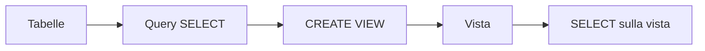
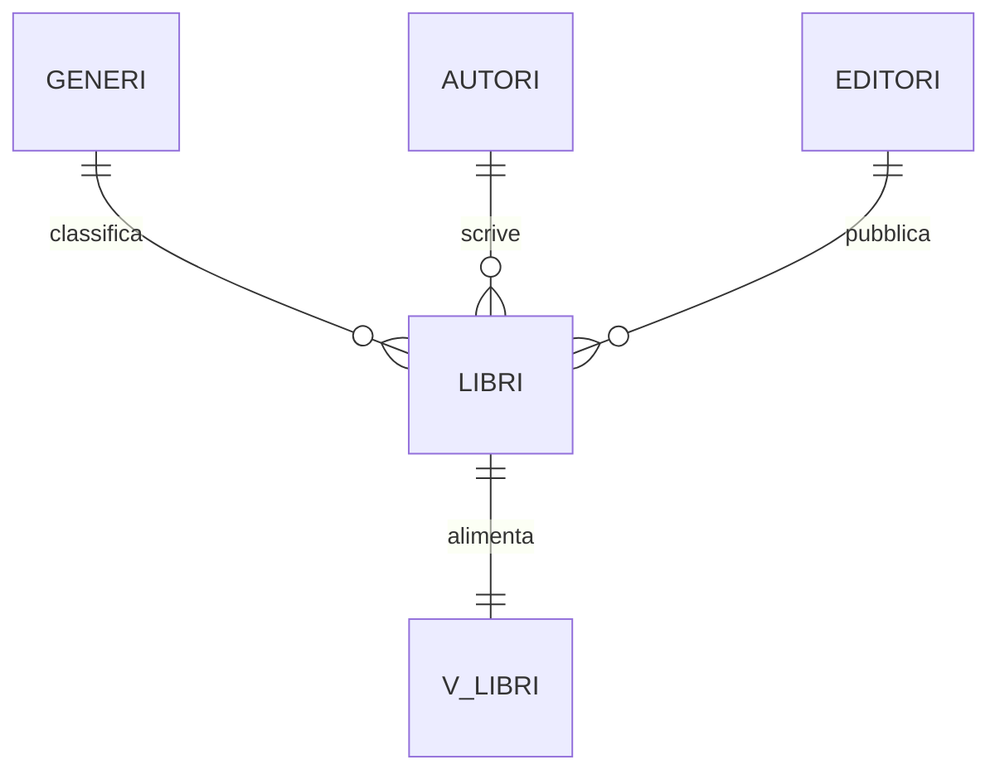
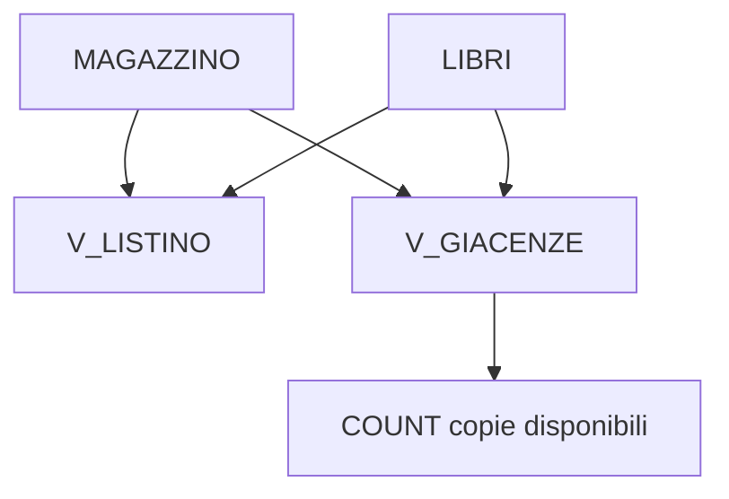
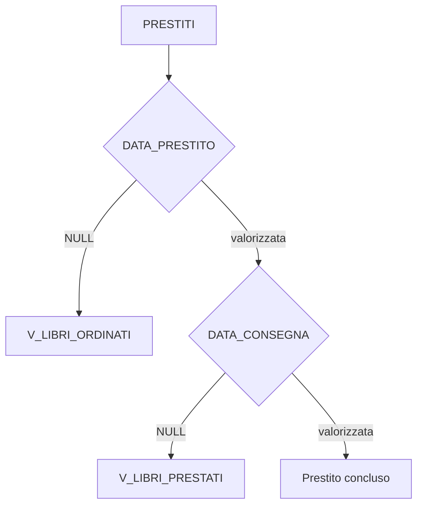

# 19 - Come si creano le viste

## Obiettivi della lezione

Al termine di questa unità il partecipante deve essere in grado di:

- spiegare che cos'è una vista;
- creare viste con `CREATE VIEW`;
- usare viste basate su `JOIN`, `GROUP BY` e funzioni SQL;
- distinguere viste di consultazione, viste di riepilogo e viste operative;
- interrogare le viste con `SELECT`.

---

## 1. Che cos'è una vista

Una vista è una query salvata nel database e interrogabile come se fosse una tabella.

La vista non sostituisce la tabella: semplifica la lettura dei dati e nasconde la complessità delle join.



---

## 2. Viste previste nel laboratorio

| Vista | Scopo |
|---|---|
| `V_LIBRI` | Libri con genere, autore ed editore |
| `V_LETTORI` | Lettori con titolo di studio e account |
| `V_CONTATTI` | Contatti dei lettori con tipo contatto |
| `V_MAGAZZINO` | Copie presenti in magazzino |
| `V_LISTINO` | Prezzo di prestito dei libri |
| `V_GIACENZE` | Quantità disponibili per libro |
| `V_PRESTITI` | Informazioni complete sui prestiti |
| `V_FATTURATO` | Operazioni che generano fatturato |
| `V_FATTURATO_MENSILE` | Fatturato raggruppato per mese |
| `V_LIBRI_ORDINATI` | Libri prenotati ma non ancora prestati |
| `V_LIBRI_PRESTATI` | Libri prestati e non ancora consegnati |
| `V_LETTORI_NON_AFFIDABILI` | Lettori con ritardo medio elevato |

---

## 3. Vista `V_LIBRI`

```sql
USE LIBRI_PRESTATI;

CREATE VIEW V_LIBRI AS
SELECT
    L.CODICE_ISBN,
    L.TITOLO,
    G.GENERE,
    A.AUTORE,
    E.EDITORE,
    L.EDIZIONE
FROM LIBRI L
JOIN GENERI G ON G.ID = L.ID_GENERE
JOIN AUTORI A ON A.ID = L.ID_AUTORE
JOIN EDITORI E ON E.ID = L.ID_EDITORE;
```



Verifica:

```sql
SELECT * FROM V_LIBRI;
```

---

## 4. Vista `V_LETTORI`

```sql
CREATE VIEW V_LETTORI AS
SELECT
    L.CODICE_LETTORE,
    L.NOME,
    L.COGNOME,
    DATE_FORMAT(L.DATA_DI_NASCITA, '%d/%m/%Y') AS DATA_DI_NASCITA,
    IF(L.SESSO, 'MASCHIO', 'FEMMINA') AS SESSO,
    T.TITOLO_DI_STUDIO,
    L.CODICE_FISCALE,
    A.NOME_UTENTE,
    A.PASSWD
FROM LETTORI L
JOIN TITOLI_DI_STUDIO T ON T.ID = L.ID_TITOLO_DI_STUDIO
JOIN ACCOUNTS A ON A.ID = L.ID_ACCOUNT;
```

Verifica:

```sql
SELECT * FROM V_LETTORI;
```

---

## 5. Viste `V_CONTATTI` e `V_MAGAZZINO`

```sql
CREATE VIEW V_CONTATTI AS
SELECT
    L.CODICE_LETTORE,
    L.NOME,
    L.COGNOME,
    C.CONTATTO,
    T.TIPO_CONTATTO
FROM CONTATTI C
JOIN LETTORI L ON L.ID = C.ID_LETTORE
JOIN TIPI_CONTATTO T ON T.ID = C.ID_TIPO_CONTATTO;
```

```sql
CREATE VIEW V_MAGAZZINO AS
SELECT
    M.CODICE_LIBRO,
    L.CODICE_ISBN,
    L.TITOLO,
    DATE_FORMAT(M.DATA_CARICO, '%d/%m/%Y') AS DATA_CARICO,
    M.PREZZO_CARICO,
    M.PREZZO_SCARICO
FROM MAGAZZINO M
JOIN LIBRI L ON L.ID = M.ID_LIBRO;
```

Verifica:

```sql
SELECT * FROM V_CONTATTI;
SELECT * FROM V_MAGAZZINO;
```

---

## 6. Viste `V_LISTINO` e `V_GIACENZE`

`V_LISTINO` mostra i libri e il prezzo di prestito.

```sql
CREATE VIEW V_LISTINO AS
SELECT DISTINCT
    L.CODICE_ISBN,
    L.TITOLO,
    M.PREZZO_SCARICO AS PREZZO
FROM MAGAZZINO M
JOIN LIBRI L ON L.ID = M.ID_LIBRO;
```

`V_GIACENZE` mostra le copie disponibili.

```sql
CREATE VIEW V_GIACENZE AS
SELECT
    L.CODICE_ISBN,
    L.TITOLO,
    COUNT(*) AS GIACENZA
FROM MAGAZZINO M
JOIN LIBRI L ON L.ID = M.ID_LIBRO
WHERE M.PRESTATO = FALSE
GROUP BY L.CODICE_ISBN, L.TITOLO;
```

Verifica:

```sql
SELECT * FROM V_LISTINO;
SELECT * FROM V_GIACENZE;
```



---

## 7. Vista `V_PRESTITI`

```sql
CREATE VIEW V_PRESTITI AS
SELECT
    P.CODICE_OPERAZIONE,
    M.CODICE_LIBRO,
    L.CODICE_LETTORE,
    DATE_FORMAT(P.DATA_OPERAZIONE, '%d/%m/%Y') AS DATA_OPERAZIONE,
    DATE_FORMAT(P.DATA_RITIRO, '%d/%m/%Y') AS DATA_RITIRO,
    IFNULL(DATE_FORMAT(P.DATA_PRESTITO, '%d/%m/%Y'), '-') AS DATA_PRESTITO,
    IFNULL(DATE_FORMAT(P.DATA_RESTITUZIONE, '%d/%m/%Y'), '-') AS DATA_RESTITUZIONE,
    IFNULL(DATE_FORMAT(P.DATA_CONSEGNA, '%d/%m/%Y'), '-') AS DATA_CONSEGNA
FROM PRESTITI P
JOIN MAGAZZINO M ON M.ID = P.ID_MAGAZZINO
JOIN LETTORI L ON L.ID = P.ID_LETTORE;
```

Verifica:

```sql
SELECT *
FROM V_PRESTITI
ORDER BY CODICE_OPERAZIONE;
```

---

## 8. Viste di fatturato

`V_FATTURATO` mostra le operazioni in cui il libro è stato effettivamente dato in prestito.

```sql
CREATE VIEW V_FATTURATO AS
SELECT
    P.CODICE_OPERAZIONE,
    M.CODICE_LIBRO,
    DATE_FORMAT(P.DATA_PRESTITO, '%d/%m/%Y') AS DATA,
    M.PREZZO_SCARICO AS PREZZO
FROM PRESTITI P
JOIN MAGAZZINO M ON M.ID = P.ID_MAGAZZINO
JOIN LETTORI L ON L.ID = P.ID_LETTORE
WHERE P.DATA_PRESTITO IS NOT NULL;
```

`V_FATTURATO_MENSILE` raggruppa il fatturato per mese.

```sql
CREATE VIEW V_FATTURATO_MENSILE AS
SELECT
    MONTH(P.DATA_PRESTITO) AS MESE,
    DATE_FORMAT(P.DATA_PRESTITO, '%Y-%m') AS PERIODO,
    SUM(M.PREZZO_SCARICO) AS PREZZO
FROM PRESTITI P
JOIN MAGAZZINO M ON M.ID = P.ID_MAGAZZINO
JOIN LETTORI L ON L.ID = P.ID_LETTORE
WHERE P.DATA_PRESTITO IS NOT NULL
GROUP BY MESE, PERIODO;
```

Verifica:

```sql
SELECT * FROM V_FATTURATO ORDER BY CODICE_OPERAZIONE;
SELECT * FROM V_FATTURATO_MENSILE ORDER BY MESE;
```

---

## 9. Viste operative sui prestiti

```sql
CREATE VIEW V_LIBRI_ORDINATI AS
SELECT
    P.CODICE_OPERAZIONE,
    M.CODICE_LIBRO,
    LB.CODICE_ISBN,
    LB.TITOLO,
    LE.CODICE_LETTORE,
    P.DATA_OPERAZIONE,
    P.DATA_RITIRO
FROM PRESTITI P
JOIN MAGAZZINO M ON M.ID = P.ID_MAGAZZINO
JOIN LIBRI LB ON LB.ID = M.ID_LIBRO
JOIN LETTORI LE ON LE.ID = P.ID_LETTORE
WHERE P.DATA_PRESTITO IS NULL;
```

```sql
CREATE VIEW V_LIBRI_PRESTATI AS
SELECT
    P.CODICE_OPERAZIONE,
    M.CODICE_LIBRO,
    LB.CODICE_ISBN,
    LB.TITOLO,
    LE.CODICE_LETTORE,
    P.DATA_OPERAZIONE,
    P.DATA_PRESTITO,
    P.DATA_RESTITUZIONE
FROM PRESTITI P
JOIN MAGAZZINO M ON M.ID = P.ID_MAGAZZINO
JOIN LIBRI LB ON LB.ID = M.ID_LIBRO
JOIN LETTORI LE ON LE.ID = P.ID_LETTORE
WHERE P.DATA_RESTITUZIONE IS NOT NULL
  AND P.DATA_CONSEGNA IS NULL;
```

Verifica:

```sql
SELECT * FROM V_LIBRI_ORDINATI;
SELECT * FROM V_LIBRI_PRESTATI;
```



---

## 10. Vista `V_LETTORI_NON_AFFIDABILI`

La vista individua lettori che hanno restituito libri con ritardo medio maggiore o uguale a 5 giorni.

```sql
CREATE VIEW V_LETTORI_NON_AFFIDABILI AS
SELECT
    L.CODICE_LETTORE,
    L.NOME,
    L.COGNOME,
    CONCAT(CEIL(AVG(DATEDIFF(P.DATA_CONSEGNA, P.DATA_RESTITUZIONE))), ' gg') AS RITARDO_MEDIO
FROM PRESTITI P
JOIN LETTORI L ON L.ID = P.ID_LETTORE
WHERE P.DATA_CONSEGNA IS NOT NULL
  AND P.DATA_RESTITUZIONE IS NOT NULL
  AND DATEDIFF(P.DATA_CONSEGNA, P.DATA_RESTITUZIONE) >= 5
GROUP BY L.CODICE_LETTORE, L.NOME, L.COGNOME;
```

Verifica:

```sql
SELECT *
FROM V_LETTORI_NON_AFFIDABILI
ORDER BY CODICE_LETTORE;
```

---

## 11. Dipendenze principali delle viste

```mermaid
flowchart TD
    LIBRI["LIBRI"] --> VLIBRI["V_LIBRI"]
    GENERI["GENERI"] --> VLIBRI
    AUTORI["AUTORI"] --> VLIBRI
    EDITORI["EDITORI"] --> VLIBRI

    LETTORI["LETTORI"] --> VLETTORI["V_LETTORI"]
    TITOLI["TITOLI_DI_STUDIO"] --> VLETTORI
    ACCOUNTS["ACCOUNTS"] --> VLETTORI

    CONTATTI["CONTATTI"] --> VCONTATTI["V_CONTATTI"]
    TIPI["TIPI_CONTATTO"] --> VCONTATTI
    LETTORI --> VCONTATTI

    MAGAZZINO["MAGAZZINO"] --> VMAG["V_MAGAZZINO"]
    LIBRI --> VMAG

    PRESTITI["PRESTITI"] --> VPRE["V_PRESTITI"]
    PRESTITI --> VFAT["V_FATTURATO"]
    PRESTITI --> VORD["V_LIBRI_ORDINATI"]
    PRESTITI --> VNON["V_LETTORI_NON_AFFIDABILI"]
```



---

## 12. Sintesi finale

Le viste consentono di presentare dati già collegati, formattati o aggregati. Sono molto utili per semplificare interrogazioni frequenti e per nascondere join ripetitive.

Il punto da ricordare è questo: una vista non elimina la complessità della query, ma la incapsula dietro un nome riutilizzabile.
