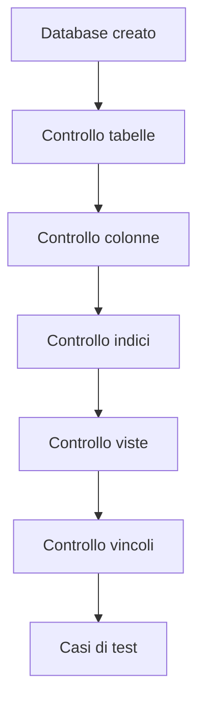
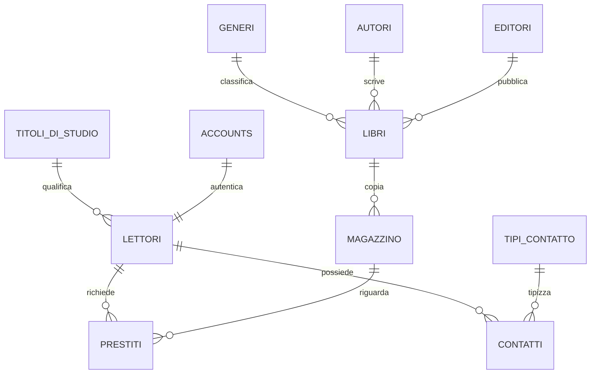
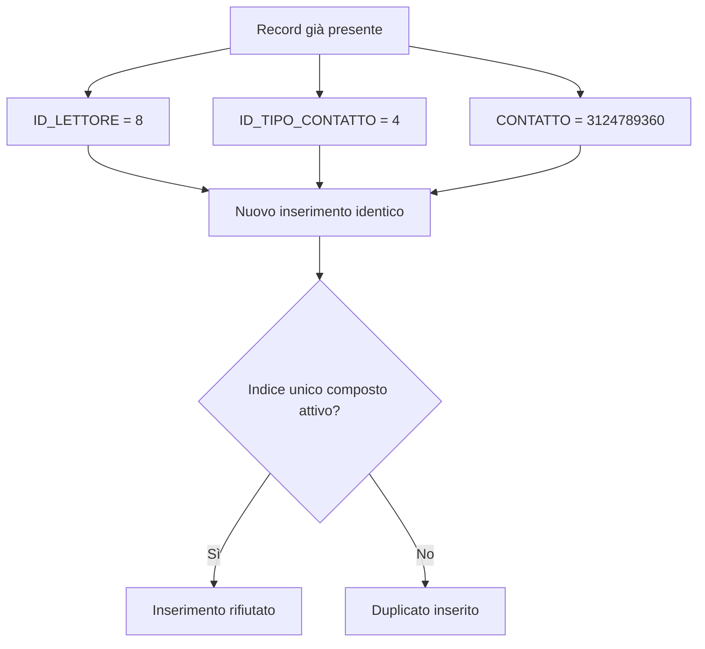
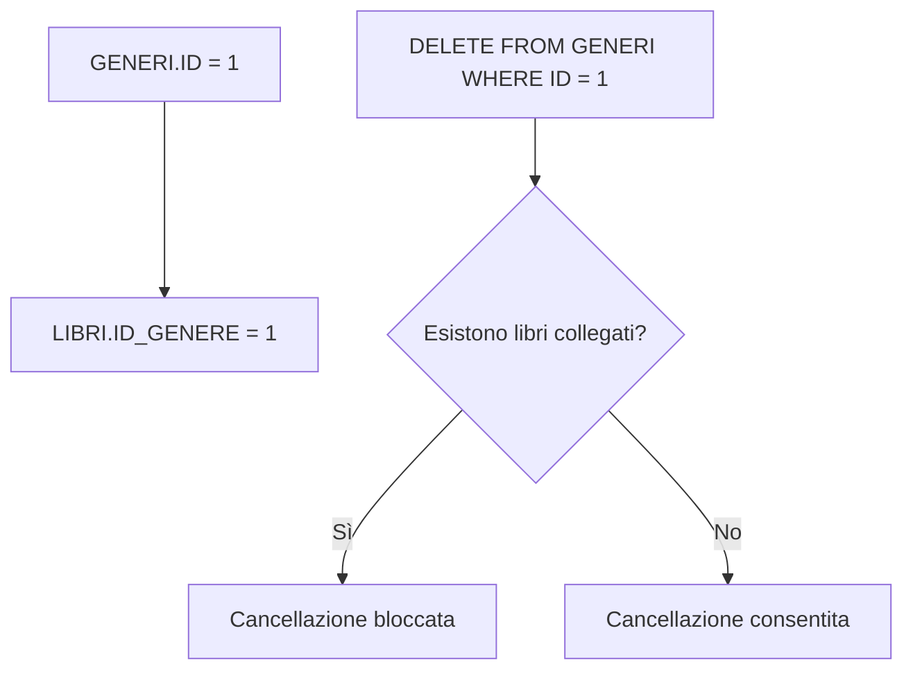
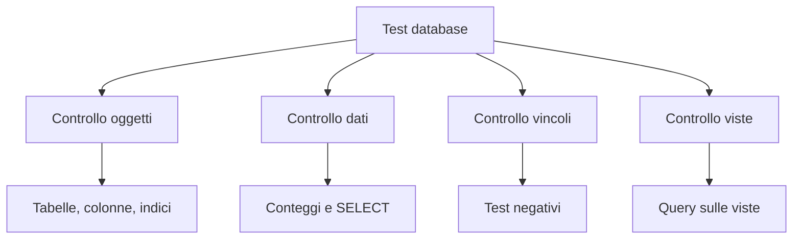

# 20 - Come si testa un database

## Obiettivi della lezione

Al termine di questa unità il partecipante deve essere in grado di:

- verificare la presenza delle tabelle;
- verificare la struttura delle tabelle;
- controllare indici, viste e vincoli;
- costruire casi di test sui vincoli principali;
- distinguere un test riuscito da un test fallito.

---

## 1. Perché testare un database

Dopo aver creato un database non basta verificarne la presenza nell'elenco di phpMyAdmin. Bisogna controllare che la struttura rispetti lo schema fisico e che i vincoli blocchino dati incoerenti.

Le attività principali sono:

1. verificare che tutte le tabelle siano state create;
2. verificare che ogni tabella abbia la struttura prevista;
3. verificare che gli indici siano presenti;
4. verificare che le viste funzionino;
5. verificare che i vincoli siano associati alle colonne corrette;
6. provare casi negativi, cioè operazioni che devono fallire.



---

## 2. Verifica delle tabelle

```sql
USE LIBRI_PRESTATI;
SHOW TABLES;
```

Tabelle attese:

| Tabella |
|---|
| `ACCOUNTS` |
| `AUTORI` |
| `CONTATTI` |
| `EDITORI` |
| `GENERI` |
| `LETTORI` |
| `LIBRI` |
| `MAGAZZINO` |
| `PRESTITI` |
| `TIPI_CONTATTO` |
| `TITOLI_DI_STUDIO` |

---

## 3. Verifica della struttura delle tabelle

```sql
DESCRIBE LIBRI;
DESCRIBE LETTORI;
DESCRIBE CONTATTI;
DESCRIBE MAGAZZINO;
DESCRIBE PRESTITI;
```

Oppure:

```sql
SHOW CREATE TABLE LIBRI;
SHOW CREATE TABLE LETTORI;
SHOW CREATE TABLE CONTATTI;
SHOW CREATE TABLE MAGAZZINO;
SHOW CREATE TABLE PRESTITI;
```

`SHOW CREATE TABLE` è più utile quando si vogliono controllare anche vincoli e opzioni tecniche.

---

## 4. Schema logico da controllare



---

## 5. Verifica degli indici

```sql
SHOW INDEX FROM LIBRI;
SHOW INDEX FROM LETTORI;
SHOW INDEX FROM CONTATTI;
SHOW INDEX FROM MAGAZZINO;
SHOW INDEX FROM PRESTITI;
```

Indici importanti da trovare:

| Tabella | Indice atteso |
|---|---|
| `CONTATTI` | `UX_CONTATTI_ID_LETTORE_ID_TIPO_CONTATTO_CONTATTO` |
| `PRESTITI` | `UX_PRESTITI_CODICE_OPERAZIONE` |
| `LETTORI` | `IX_LETTORI_CITTA_COGNOME_NOME` |
| `LIBRI` | `IX_LIBRI_TITOLO` |
| `MAGAZZINO` | `IX_MAGAZZINO_ID_LIBRO` |

---

## 6. Verifica delle viste

```sql
SHOW FULL TABLES
WHERE TABLE_TYPE = 'VIEW';
```

Viste attese:

| Vista |
|---|
| `V_LIBRI` |
| `V_LETTORI` |
| `V_LETTORI_NON_AFFIDABILI` |
| `V_CONTATTI` |
| `V_MAGAZZINO` |
| `V_GIACENZE` |
| `V_LISTINO` |
| `V_PRESTITI` |
| `V_LIBRI_ORDINATI` |
| `V_LIBRI_PRESTATI` |
| `V_FATTURATO` |
| `V_FATTURATO_MENSILE` |

Verifica rapida:

```sql
SELECT * FROM V_LIBRI;
SELECT * FROM V_LETTORI;
SELECT * FROM V_CONTATTI;
SELECT * FROM V_MAGAZZINO;
SELECT * FROM V_GIACENZE;
SELECT * FROM V_PRESTITI ORDER BY CODICE_OPERAZIONE;
```

---

## 7. Verifica dei vincoli di chiave esterna

Per controllare le foreign key:

```sql
SELECT
    TABLE_NAME,
    CONSTRAINT_NAME,
    COLUMN_NAME,
    REFERENCED_TABLE_NAME,
    REFERENCED_COLUMN_NAME
FROM INFORMATION_SCHEMA.KEY_COLUMN_USAGE
WHERE TABLE_SCHEMA = 'LIBRI_PRESTATI'
  AND REFERENCED_TABLE_NAME IS NOT NULL
ORDER BY TABLE_NAME, CONSTRAINT_NAME;
```

Questa query legge il dizionario dati di MySQL e permette di verificare le chiavi esterne definite nello schema.

---

## 8. Caso di test 1: indice unico composto su `CONTATTI`

### Specifica da verificare

Non deve essere possibile inserire due contatti identici per lo stesso lettore e per lo stesso tipo di contatto.



### Test

```sql
SELECT *
FROM CONTATTI
WHERE ID_LETTORE = 8
  AND ID_TIPO_CONTATTO = 4
  AND CONTATTO = '3124789360';
```

```sql
INSERT INTO CONTATTI (ID_LETTORE, ID_TIPO_CONTATTO, CONTATTO)
VALUES (8, 4, '3124789360');
```

### Risultato atteso

L'inserimento deve fallire per violazione dell'indice unico composto.

---

## 9. Caso di test 2: integrità referenziale su `LIBRI.ID_GENERE`

### Prima prova: inserimento con genere inesistente

```sql
SELECT * FROM GENERI;
```

Scegliere un `ID` che non esiste, ad esempio `999`.

```sql
INSERT INTO LIBRI
(TITOLO, CODICE_ISBN, ID_GENERE, ID_AUTORE, ID_EDITORE, EDIZIONE)
VALUES
('Libro con genere inesistente', '9999999999999', 999, 1, 1, '2026');
```

Risultato atteso: l'inserimento deve fallire.

### Seconda prova: cancellazione di un genere usato

```sql
SELECT ID_GENERE, COUNT(*) AS NUMERO_LIBRI
FROM LIBRI
GROUP BY ID_GENERE;
```

Scegliere un genere usato da almeno un libro.

```sql
DELETE FROM GENERI
WHERE ID = 1;
```

Risultato atteso: la cancellazione deve fallire se esistono libri collegati.



---

## 10. Caso di test 3: vincolo `CHECK` sul prezzo di carico

### Specifica da verificare

Non deve essere possibile caricare in magazzino un libro con `PREZZO_CARICO` negativo.

```sql
INSERT INTO MAGAZZINO
(ID_LIBRO, CODICE_LIBRO, CODICE_SCAFFALE, DATA_CARICO, PRESTATO, PREZZO_CARICO, PREZZO_SCARICO)
VALUES
(1, 'TESTNEG001', 'TEST01', CURRENT_DATE, FALSE, -10.00, 3.00);
```

### Risultato atteso

Con una versione moderna di MySQL e vincolo `CHECK` attivo, l'inserimento deve fallire.

Se l'inserimento viene accettato, il vincolo non è realmente applicato oppure si sta usando una versione/configurazione che non lo gestisce come atteso.

---

## 11. Scheda sintetica per documentare un caso di test

| Campo | Contenuto |
|---|---|
| ID test | Codice del caso di test |
| Obiettivo | Cosa si vuole verificare |
| Precondizioni | Dati o oggetti necessari |
| Comando SQL | Operazione da eseguire |
| Risultato atteso | Cosa deve succedere |
| Risultato ottenuto | Cosa è successo davvero |
| Esito | Superato / non superato |
| Note | Eventuali osservazioni |

Esempio:

| Campo | Contenuto |
|---|---|
| ID test | `TC_CONTATTI_001` |
| Obiettivo | Verificare indice unico composto su `CONTATTI` |
| Precondizioni | Esiste il contatto `(8, 4, '3124789360')` |
| Comando SQL | `INSERT INTO CONTATTI ...` |
| Risultato atteso | Inserimento rifiutato |
| Risultato ottenuto | Errore di chiave duplicata |
| Esito | Superato |

---

## 12. Controlli finali consigliati

```sql
SELECT COUNT(*) AS NUMERO_LIBRI FROM LIBRI;
SELECT COUNT(*) AS NUMERO_LETTORI FROM LETTORI;
SELECT COUNT(*) AS NUMERO_CONTATTI FROM CONTATTI;
SELECT COUNT(*) AS NUMERO_PRESTITI FROM PRESTITI;
```

```sql
SELECT * FROM V_GIACENZE;
SELECT * FROM V_FATTURATO_MENSILE ORDER BY MESE;
SELECT * FROM V_LETTORI_NON_AFFIDABILI ORDER BY CODICE_LETTORE;
```

---

## 13. Sintesi finale



Un database testato non è automaticamente perfetto, ma ha superato controlli oggettivi su struttura, dati, viste e vincoli.
